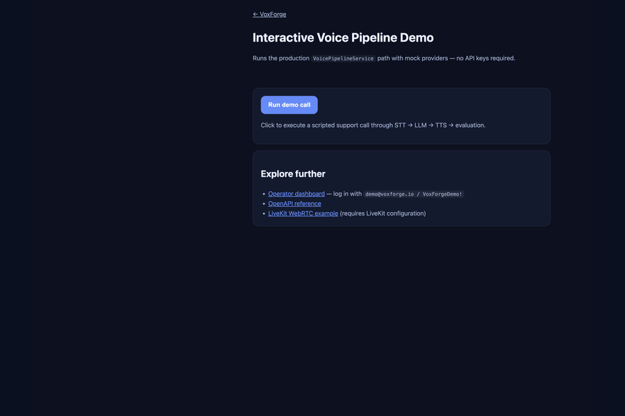

# VoxForge

[](https://github.com/Brohammad/VoxFauge/actions/workflows/ci.yml)
[](https://github.com/Brohammad/VoxFauge/releases/tag/v1.0.0-rc.1)
[](https://voxforge.brohammad.tech/demo)
[](https://www.python.org/downloads/)
[](docs/testing/coverage-report.md)
[](LICENSE)

**Production-grade Voice AI Infrastructure** — deploy, operate, and trust.

🌐 **Live:** [voxforge.brohammad.tech](https://voxforge.brohammad.tech) · [Demo](https://voxforge.brohammad.tech/demo) · [Dashboard](https://voxforge.brohammad.tech/dashboard) · [API](https://voxforge.brohammad.tech/api/v1/docs)



VoxForge is an open-source platform for building and operating enterprise voice agents. Unlike chatbot wrappers, it ships a **complete voice stack**: transport, orchestration, knowledge retrieval, tool execution, per-turn evaluation, session replay, human handoff, and an operator dashboard — all deployable to your own infrastructure.

> **v1.0.0-rc.1** is live in production with HTTPS, automated tests, and a public demo. [Release notes →](docs/release/v1.0.0-rc.1.md)

---

## What you get

| Layer | Capabilities |
|-------|----------------|
| **Voice** | WebSocket gateway, programmatic onboarding API, LiveKit WebRTC |
| **Intelligence** | LangGraph agent orchestrator (planner, safety, executor, critic) |
| **Knowledge** | Document upload, chunking, pgvector search, citation grounding |
| **Tools** | Builtin tools + MCP server discovery at runtime |
| **Operations** | Dashboard, latency analytics, alerts, policy presets, SAML SSO |
| **Trust** | Per-turn evaluation, signed replay links, human handoff queue |
| **Deploy** | Docker Compose, NGINX, Let's Encrypt, health/readiness probes |

One `VoicePipelineService` powers every transport — no duplicated business logic across WebSocket, REST onboarding, or WebRTC.

---

## Why VoxForge

| | VoxForge | Typical chatbot demo |
|---|----------|---------------------|
| **Deploy** | Self-hosted Docker + HTTPS | Vendor lock-in |
| **Pipeline** | STT → agent → TTS + evaluation | LLM wrapper only |
| **Operations** | Dashboard, replay, handoff queue | Logs in a black box |
| **Tests** | 354+ automated tests | Unknown |
| **Extensibility** | MCP tools, swappable providers | Hardcoded integrations |

Compared to managed platforms (Vapi, Retell) you get **data sovereignty and no per-minute platform tax**. Compared to frameworks (LiveKit Agents, Pipecat, LangGraph alone) you get a **batteries-included product** with auth, dashboard, and deploy scripts.

[Full competitive benchmark →](docs/benchmarks/competitive-analysis.md)

---

## Who it's for

- **Engineers** building voice agents who want a real architecture, not a prototype
- **Operators** who need replay, metrics, and escalation workflows
- **Teams** evaluating self-hosted voice AI before committing to a SaaS vendor
- **Contributors** looking for a well-tested, documented open-source codebase

---

## Quick start (15 minutes)

**Prerequisites:** Python 3.12+, Docker, [uv](https://docs.astral.sh/uv/) (recommended)

```bash
git clone https://github.com/Brohammad/VoxFauge.git
cd VoxFauge
cp .env.example .env
uv sync                    # or: pip install -e ".[dev,livekit]"
docker compose up -d postgres redis
alembic upgrade head
uvicorn voxforge.main:app --reload --app-dir src
```

| Surface | Local URL |
|---------|-----------|
| Landing | http://localhost:8000/ |
| Demo | http://localhost:8000/demo |
| Dashboard | http://localhost:8000/dashboard |
| API docs | http://localhost:8000/api/v1/docs |

Mock STT/LLM/TTS providers work **without API keys**. Click **Run demo call** at `/demo` to exercise the full pipeline.

Detailed walkthrough: [docs/ONBOARDING.md](docs/ONBOARDING.md)

### First API calls

```bash
# Health
curl http://localhost:8000/api/v1/health

# Register + login (dashboard uses the same endpoints)
curl -X POST http://localhost:8000/api/v1/auth/register \
  -H 'Content-Type: application/json' \
  -d '{"email":"you@example.com","password":"your-secure-password","full_name":"You"}'

# One-click demo (no auth required when DEMO_ENABLED=true)
curl -X POST http://localhost:8000/api/v1/demo/quickstart
```

---

## Production deployment

Deploy to a fresh Ubuntu 24.04 VPS with HTTPS in one flow:

```bash
./scripts/setup-production-env.sh your-domain.example
# Edit .env.production if needed (providers, LiveKit)
./deploy.sh init
```

`deploy.sh` handles environment validation, Docker image build, NGINX + Certbot TLS, health-gated startup, and optional workers (knowledge, LiveKit, Prometheus/Grafana).

```bash
./deploy.sh status    # service health
./deploy.sh backup    # Postgres backup
./deploy.sh smoke     # local prod validation (no TLS)
```

| Guide | Description |
|-------|-------------|
| [Deployment guide](docs/deployment/guide.md) | Full VPS setup |
| [Runbook](docs/operations/runbook.md) | Day-2 operations |
| [Public deployment](docs/deployment/public-deployment-record.md) | Live instance reference |
| [Verification checklist](docs/deployment/verification-checklist.md) | Post-deploy QA |

**Reference deployment:** https://voxforge.brohammad.tech (Let's Encrypt, smoke-tested)

---

## Architecture

```text
Client
  → Transport (WebSocket / LiveKit WebRTC / REST onboarding)
  → VoicePipelineService
  → Agent Orchestrator (LangGraph)
  → MCP Tool Router + Knowledge RAG + Memory
  → Evaluation Engine
  → Replay / Handoff / Dashboard
```

| Module | Responsibility |
|--------|----------------|
| **Auth** | JWT, RBAC, organizations, API keys, SAML SSO |
| **Voice Gateway** | WebSocket streaming, session lifecycle |
| **Agent Orchestrator** | Multi-agent pipeline with safety and critic stages |
| **Knowledge** | Ingestion, embedding, semantic search, citations |
| **Memory** | Semantic retrieval, summarization (pgvector) |
| **Handoff** | Human escalation queue, signed replay URLs |
| **Evaluation** | Per-turn latency, quality, tool, and cost scoring |
| **Dashboard** | Operator UI + analytics API |
| **LiveKit Gateway** | WebRTC token generation and worker dispatch |

Built as a **modular monolith** with Clean Architecture — clear module boundaries without microservice operational overhead.

[Architecture diagrams](docs/portfolio/architecture-diagrams.md) · [Voice pipeline](docs/architecture/voice-pipeline.md) · [Architecture index](docs/architecture/README.md) · [ADRs](docs/adr/README.md)

---

## Tech stack

| Component | Technology |
|-----------|------------|
| API | FastAPI, Uvicorn, Python 3.12 |
| Agents | LangGraph, LangChain |
| Database | PostgreSQL 16 + pgvector |
| Cache / queues | Redis |
| Observability | OpenTelemetry, Prometheus, structured logging |
| Frontend | Static dashboard + landing (no Node build step) |
| Deploy | Docker Compose, NGINX, Certbot |
| CI | pytest, Playwright, ruff, pip-audit, gitleaks |

---

## Voice providers

Swap providers via environment variables — no code changes:

| Role | Options | Default (local) |
|------|---------|-----------------|
| STT | `mock`, `deepgram`, `openai` | `mock` |
| LLM | `mock`, `openai` | `mock` |
| TTS | `mock`, `openai`, `cartesia`, `elevenlabs` | `mock` |
| Embeddings | `mock`, `openai` | `mock` |

```bash
STT_PROVIDER=deepgram
LLM_PROVIDER=openai
TTS_PROVIDER=elevenlabs
OPENAI_API_KEY=sk-...
DEEPGRAM_API_KEY=...
```

Production validation enforces real providers when `DEMO_ENABLED=false`.

---

## Testing

```bash
make test              # 346+ tests (~16s, excludes browser)
make test-browser      # 8 Playwright UI journeys
make test-unit         # Unit tests only
make test-integration  # Integration tests
make test-feature      # Feature scenarios
make test-failure      # Failure-mode tests
make test-cov          # Coverage report (70% gate)
ruff check src tests   # Lint
```

| Layer | Location | Count |
|-------|----------|-------|
| Unit | `tests/unit/` | Core logic |
| Integration | `tests/integration/` | DB, Redis, providers |
| Feature | `tests/feature/` | End-to-end flows |
| Browser | `tests/browser/` | Landing, demo, dashboard, KB |
| Failure | `tests/failure/` | Provider errors, timeouts |

CI runs the full suite on every push to `main`. See [testing strategy](docs/testing/testing-strategy.md).

---

## Project structure

```text
src/voxforge/          Application code (Clean Architecture)
  core/                Domain interfaces and models
  modules/             Feature modules (auth, voice, knowledge, …)
  infrastructure/      Providers, HTTP, persistence, LiveKit
dashboard/             Operator UI (static HTML/JS)
public/                Landing page, demo, assets
deploy/                NGINX templates, TLS config
docs/                  Architecture, deployment, pilot guides
tests/                 Unit → browser test pyramid
scripts/               Deploy, backup, benchmarks, smoke tests
```

---

## Documentation

**Full index:** [docs/README.md](docs/README.md)

| Topic | Link |
|-------|------|
| Quick start | [docs/ONBOARDING.md](docs/ONBOARDING.md) |
| Configuration | [docs/CONFIGURATION.md](docs/CONFIGURATION.md) |
| Deployment | [docs/deployment/](docs/deployment/) |
| Architecture | [docs/architecture/](docs/architecture/) |
| Operations | [docs/operations/](docs/operations/) |
| Testing | [docs/testing/](docs/testing/) |
| Pilot program | [docs/pilot/](docs/pilot/) |
| FAQ | [docs/FAQ.md](docs/FAQ.md) |
| Roadmap | [docs/ROADMAP.md](docs/ROADMAP.md) |
| Releases | [docs/release/](docs/release/) |

---

## FAQ

**Do I need API keys locally?**  
No — mock providers work out of the box.

**Is LiveKit required?**  
No — WebSocket voice works without it. LiveKit adds browser WebRTC.

**Can I self-host in production?**  
Yes — `./deploy.sh init` on Ubuntu 24.04 with automatic HTTPS.

**What's not production-ready yet?**  
Zendesk/Freshdesk connectors are stubs; dashboard JWT uses localStorage (httpOnly cookies planned for v1.1). See [known limitations](docs/release/known-limitations.md).

[Full FAQ →](docs/FAQ.md)

---

## Contributing

Contributions welcome — especially docs, tests, and provider adapters.

1. Fork the repo
2. Create a branch (`git checkout -b fix/issue`)
3. Run `make test` and `ruff check src tests`
4. Open a PR using the template

See [CONTRIBUTING.md](CONTRIBUTING.md) · [CODE_OF_CONDUCT.md](CODE_OF_CONDUCT.md) · [SECURITY.md](SECURITY.md)

**Good first issues:** look for the `good first issue` label on GitHub.

---

## License

MIT — see [LICENSE](LICENSE).
