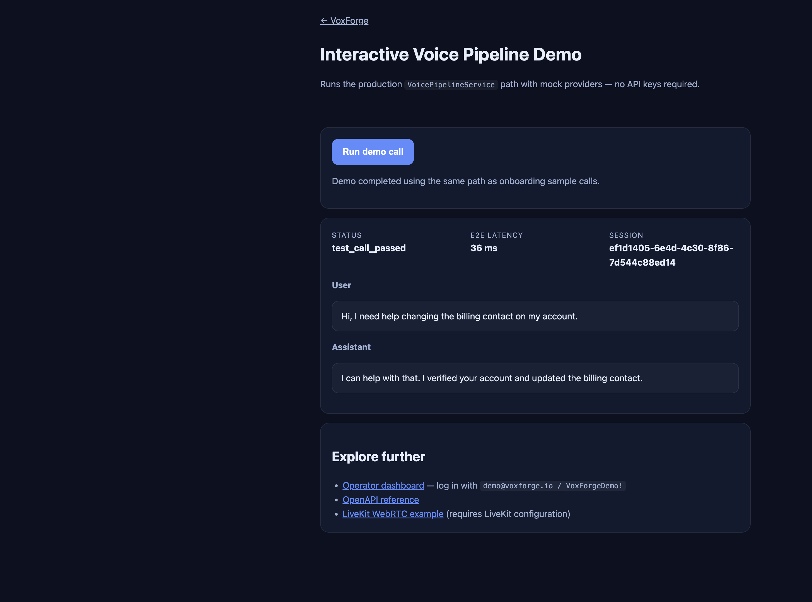

# VoxForge

[](https://github.com/Brohammad/VoxForge/actions/workflows/ci.yml)
[](https://voxforge.brohammad.tech/demo)
[](https://www.python.org/downloads/)
[](docs/testing/coverage-report.md)
[](LICENSE)

**Production-grade Voice AI Infrastructure** — deploy, operate, and trust.

🌐 **Live:** [voxforge.brohammad.tech](https://voxforge.brohammad.tech) · [Demo](https://voxforge.brohammad.tech/demo) · [Dashboard](https://voxforge.brohammad.tech/dashboard) · [API](https://voxforge.brohammad.tech/api/v1/docs)



Open-source platform for enterprise voice agents: one pipeline for WebSocket, programmatic onboarding, and LiveKit WebRTC — with knowledge RAG, MCP tools, evaluation, replay, and human handoff.

## Why VoxForge

| | VoxForge | Typical chatbot demo |
|---|----------|---------------------|
| **Deploy** | Self-hosted Docker + HTTPS | Vendor lock-in |
| **Pipeline** | STT → agent → TTS + evaluation | LLM wrapper only |
| **Operations** | Dashboard, replay, handoff queue | Logs in a black box |
| **Tests** | 354+ automated tests | Unknown |

[Competitive benchmark →](docs/benchmarks/competitive-analysis.md)

## Quick start (15 minutes)

```bash
git clone https://github.com/Brohammad/VoxForge.git
cd VoxForge
cp .env.example .env
uv sync                    # or: pip install -e ".[dev,livekit]"
docker compose up -d postgres redis
alembic upgrade head
uvicorn voxforge.main:app --reload --app-dir src
```

| Surface | URL |
|---------|-----|
| Landing | http://localhost:8000/ |
| Demo | http://localhost:8000/demo |
| Dashboard | http://localhost:8000/dashboard |
| API docs | http://localhost:8000/api/v1/docs |

Mock providers work out of the box — no API keys. Full path: [docs/ONBOARDING.md](docs/ONBOARDING.md).

## Production deployment

```bash
./scripts/setup-production-env.sh your-domain.example
./deploy.sh init
```

See [deployment guide](docs/deployment/guide.md) · [runbook](docs/operations/runbook.md) · [public deployment record](docs/deployment/public-deployment-record.md)

## Architecture

```text
Client → Transport (WS / LiveKit) → Voice Pipeline → Agent Orchestrator → MCP → Evaluation → Replay
```

| Module | Responsibility |
|--------|----------------|
| **Auth** | JWT, RBAC, API keys, SAML SSO |
| **Voice Gateway** | WebSocket + `VoicePipelineService` |
| **Agent Orchestrator** | LangGraph multi-agent pipeline |
| **Knowledge** | Document ingestion, pgvector RAG |
| **Handoff** | Human escalation + replay links |
| **Dashboard** | Operator UI + analytics |

[Architecture diagrams](docs/portfolio/architecture-diagrams.md) · [Voice pipeline](docs/architecture/voice-pipeline.md)

## Development

```bash
make test              # pytest (excludes browser)
make test-browser      # 8 Playwright journeys
make test-cov          # 70% coverage gate
ruff check src tests
```

## Documentation

| Topic | Link |
|-------|------|
| 15-min onboarding | [docs/ONBOARDING.md](docs/ONBOARDING.md) |
| Pilot program | [docs/pilot/onboarding-guide.md](docs/pilot/onboarding-guide.md) |
| Demo scripts | [docs/demo/](docs/demo/) |
| Operations | [docs/operations/runbook.md](docs/operations/runbook.md) |
| Launch checklist | [docs/launch/LAUNCH-CHECKLIST.md](docs/launch/LAUNCH-CHECKLIST.md) |
| FAQ | [docs/FAQ.md](docs/FAQ.md) |
| Roadmap | [docs/ROADMAP.md](docs/ROADMAP.md) |
| Changelog | [CHANGELOG.md](CHANGELOG.md) |

## Contributing

See [CONTRIBUTING.md](CONTRIBUTING.md) · [CODE_OF_CONDUCT.md](CODE_OF_CONDUCT.md) · [SECURITY.md](SECURITY.md)

## License

MIT — see [LICENSE](LICENSE).
