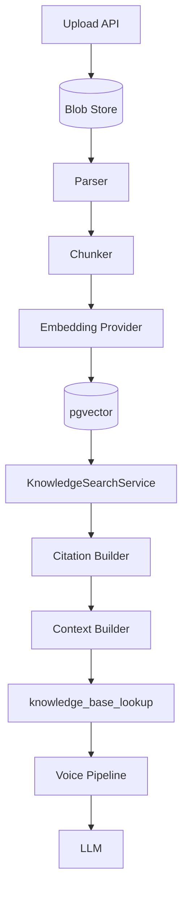

# ADR-005 Supplement: Knowledge Base Retrieval Pipeline

## Status

Accepted (2026-07-10)

## Context

[ADR-005](./ADR-005-enterprise-knowledge-base.md) defines storage, ingestion, and provider ports for the enterprise knowledge base. Operators and interview discussions benefit from a single end-to-end view of how uploaded documents become grounded agent context during a voice session.

## Decision

Document the **retrieval pipeline** as a linear flow from upload through the voice agent to the LLM. Each stage is a discrete, testable component with clear boundaries; Postgres remains authoritative for chunks and versions, Redis is not used on this path.

### Pipeline diagram

```text
Upload
  ↓
Blob Store
  ↓
Parser
  ↓
Chunker
  ↓
Embedding Provider
  ↓
pgvector
  ↓
Search
  ↓
Citation Builder
  ↓
Context Builder
  ↓
knowledge_base_lookup
  ↓
Voice Pipeline
  ↓
LLM
```

### Stage responsibilities

| Stage | Component | Responsibility |
|-------|-----------|----------------|
| **Upload** | `KnowledgeIngestionService.upload_document` | Accept file, create document + version, enqueue job |
| **Blob Store** | `BlobStore` (filesystem / S3) | Persist raw bytes keyed by org/document/version |
| **Parser** | `infrastructure/knowledge/parsers/` | Bytes → `ParsedDocument` with title and metadata |
| **Chunker** | `infrastructure/knowledge/chunking/` | `ParsedDocument` → `list[RawChunk]` per collection config |
| **Embedding Provider** | `EmbeddingProvider` port | `embed_batch()` for chunk texts |
| **pgvector** | `KnowledgeRepository` | Upsert chunks + HNSW cosine search scoped by `org_id` |
| **Search** | `KnowledgeSearchService` | Query embed + vector search + assemble `ChunkSearchResult` |
| **Citation Builder** | `citation.build_citation` | Structured citation metadata per result |
| **Context Builder** | `AgentContextBuilder` | Format citations/snippets for agent grounding |
| **knowledge_base_lookup** | `InternalKnowledgeBaseProvider` | Tool adapter; preserves existing tool contract |
| **Voice Pipeline** | `VoicePipelineService` | Invokes tools via `ToolRouter` during agent turns |
| **LLM** | `ResponseGenerator` / orchestrator | Consumes tool output and session context in prompt |

### Mermaid view



## Consequences

**Positive**

- Single reference diagram for onboarding, ops, and architecture reviews
- Each stage maps to existing code paths and benchmark metrics
- Clear separation between ingestion (async worker) and retrieval (sync search)

**Negative / trade-offs**

- Diagram omits background job queue and worker polling (ingest sidecar)
- `Context Builder` injection into prompts is optional (`KNOWLEDGE_CONTEXT_ENABLED`)
- External KB providers (Zendesk/Freshdesk) bypass internal stages after the tool boundary

## References

- [ADR-005: Enterprise Knowledge Base](./ADR-005-enterprise-knowledge-base.md)
- [Knowledge Base Architecture](../architecture/knowledge-base.md)
- [Knowledge Base Benchmarks](../benchmarks/knowledge-base.md)
