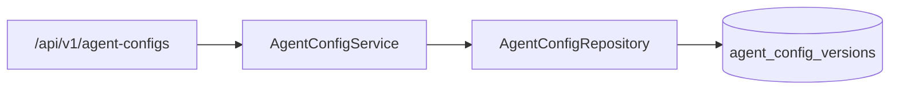

# Agent Config Versioning Architecture

## Overview

Org-scoped prompt/orchestrator/eval config versions support activation history and one-click rollback when quality regressions appear.

## Data model

Table: `agent_config_versions`

- `org_id`, `version` (monotonic per org)
- `prompt_config`, `orchestrator_config`, `eval_thresholds`
- `is_active` (at most one active version per org operationally)
- `change_note`, `created_by_user_id`

## API

| Method | Path | Description |
|--------|------|-------------|
| GET | `/api/v1/agent-configs` | List versions (newest first) |
| GET | `/api/v1/agent-configs/active` | Current active version |
| POST | `/api/v1/agent-configs` | Create (and optionally activate) a version |
| POST | `/api/v1/agent-configs/rollback` | Activate a new version copied from an older one |

Rollback always creates a **new** version (immutable history), never mutates old rows.
