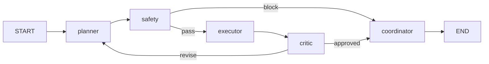

# Agent Orchestrator Architecture

## Overview

The Agent Orchestrator uses **LangGraph** to run a multi-agent pipeline for voice responses:



## Agents

| Agent | Role |
|-------|------|
| **Planner** | Creates a brief response plan from conversation context |
| **Safety** | Blocks unsafe requests before execution |
| **Executor** | Drafts the user-facing response following the plan |
| **Critic** | Reviews draft quality; triggers revision loop if needed |
| **Coordinator** | Finalizes the response for streaming to TTS |

Only the **coordinator's final output** streams to the client as voice tokens. Internal agent steps emit `agent_step` WebSocket events for observability.

## Modes

Set `ORCHESTRATOR_MODE` in `.env`:

| Mode | Behavior |
|------|----------|
| `single` | Direct LLM via `ConversationEngine` (default) |
| `multi_agent` | Full LangGraph pipeline via `AgentOrchestrator` |

Per-session override via WebSocket start config:
```json
{"type": "start", "config": {"orchestrator": "multi_agent"}}
```

## Configuration

```env
ORCHESTRATOR_MODE=multi_agent
MAX_AGENT_ITERATIONS=2
PLANNER_MODEL=gpt-4o-mini
EXECUTOR_MODEL=gpt-4o-mini
CRITIC_MODEL=gpt-4o-mini
SAFETY_MODEL=gpt-4o-mini
```

## WebSocket Events

New server event during multi-agent turns:
```json
{"type": "agent_step", "agent": "planner", "status": "completed", "summary": "..."}
```

Agent traces are persisted in `messages.provider_metadata.agent_trace`.

## Integration

Both `ConversationEngine` and `AgentOrchestrator` implement the `ResponseGenerator` protocol, allowing the voice pipeline to swap backends without changing STT/TTS transport.
