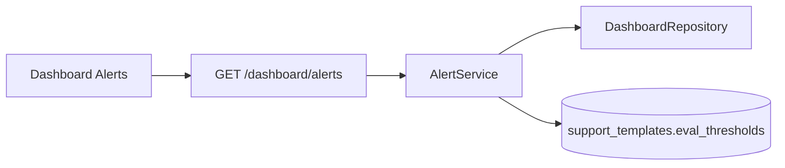

# Regression Alerts Architecture

## Overview

The alerts engine compares live org aggregates against default support-template thresholds and returns active regressions for ops review.

## Checks

| Code | Trigger |
|------|---------|
| `task_success_regression` | success rate < `task_success_min` |
| `escalation_spike` | escalation rate > `escalation_max` |
| `quality_regression` | avg eval score < `quality_min` |
| `failed_evaluation_rate` | failed/total > `failed_evaluation_max_rate` |
| `latency_regression` | avg e2e ms > `e2e_latency_max_ms` |

Severity becomes `critical` for deeper regressions (for example success/quality below 85% of threshold, or latency above 1.5x target).

## API

| Method | Path | Description |
|--------|------|-------------|
| GET | `/api/v1/dashboard/alerts?days=7\|30` | Active alerts + resolved thresholds |

## Metrics

- `voxforge_regression_alerts_total{code,severity}`
