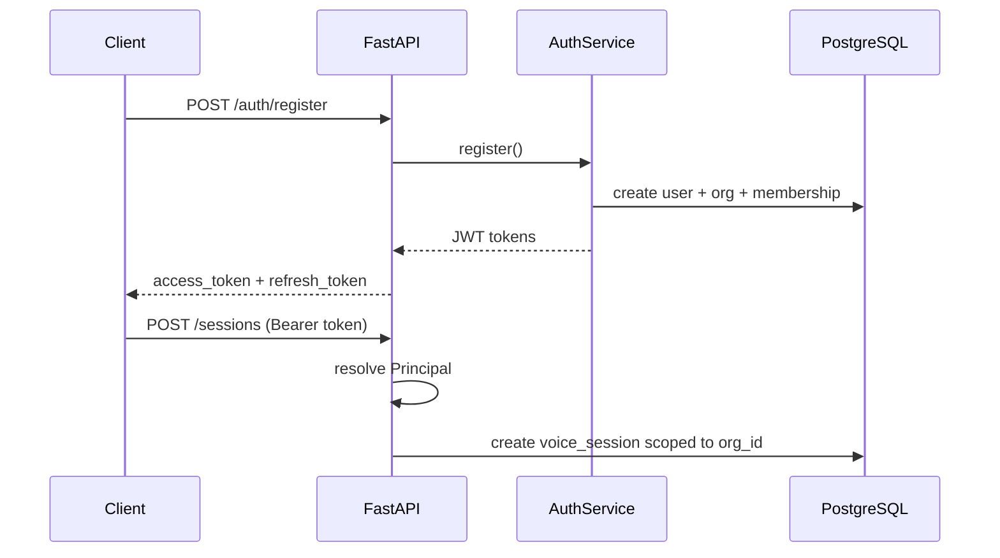

# Authentication Architecture

## Overview

VoxForge Authentication provides enterprise-ready identity and access control:

- **JWT** — access + refresh tokens with org and role claims
- **RBAC** — owner / admin / member roles with scoped permissions
- **Organizations** — multi-tenant isolation
- **API Keys** — machine-to-machine access with scoped permissions

## Auth Flow



## Principal Resolution

REST endpoints resolve the caller via:

1. `Authorization: Bearer <access_token>` (JWT)
2. `X-API-Key: <api_key>` (org-scoped API key)

WebSocket voice sessions authenticate on the `start` control message via:

- `Authorization` header on the WebSocket upgrade, or
- `token` / `api_key` fields in the start message JSON

## RBAC Scopes

| Role | Scopes |
|------|--------|
| owner | All scopes including org management |
| admin | Sessions, API keys, member management |
| member | sessions:read, sessions:write, ws:connect |

API keys carry explicit scope lists (e.g. `sessions:write`, `ws:connect`).

## Database Tables

- `users` — email, hashed password, profile
- `organizations` — tenant entities
- `organization_members` — user ↔ org with role
- `api_keys` — hashed keys with scopes and expiry
- `audit_logs` — security audit trail
- `voice_sessions.org_id` — tenant isolation for voice sessions

## API Endpoints

| Method | Path | Auth | Description |
|--------|------|------|-------------|
| POST | `/api/v1/auth/register` | Public | Register user + org |
| POST | `/api/v1/auth/login` | Public | Login, get tokens |
| POST | `/api/v1/auth/refresh` | Public | Refresh access token |
| GET | `/api/v1/auth/me` | JWT | Current user profile |
| GET | `/api/v1/orgs` | JWT | List user's orgs |
| POST | `/api/v1/api-keys` | JWT | Create API key |
| POST | `/api/v1/sessions` | JWT/API Key | Create voice session |

## Configuration

```env
JWT_SECRET_KEY=your-secret-key-min-32-chars
JWT_ACCESS_TOKEN_EXPIRE_MINUTES=60
API_KEY_HASH_PEPPER=your-pepper
AUTH_REQUIRED=true
```
