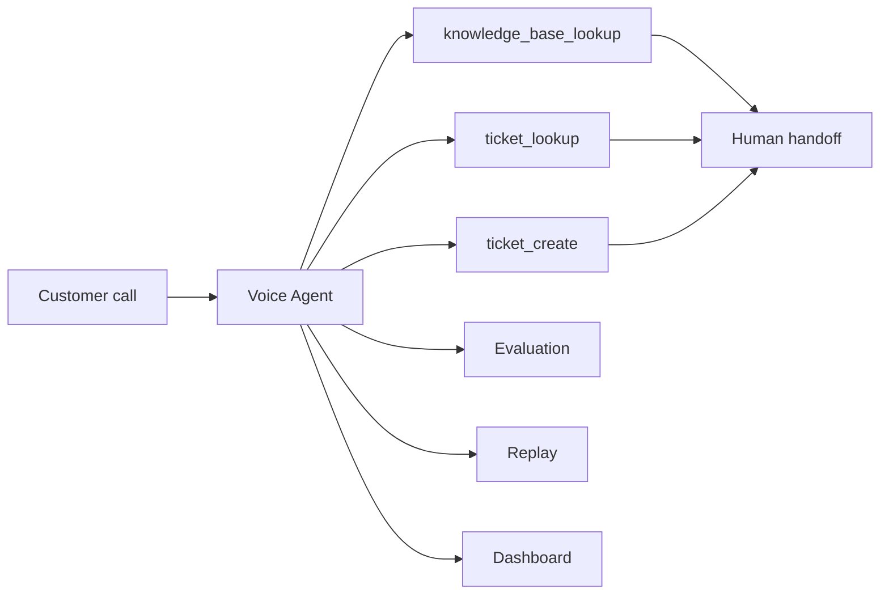

# Customer Support Tools

Enterprise support capabilities for the VoxForge voice agent workflow.

## Product flow



## Tools

| Tool | Purpose |
|------|---------|
| `knowledge_base_lookup` | Search KB articles for self-service answers |
| `ticket_lookup` | Find tickets by ID or customer email |
| `ticket_create` | Open a new support ticket for human follow-up |

Tools are enabled when `SUPPORT_TOOLS_ENABLED=true` (default) and `TOOLS_ENABLED=true`.

## Architecture

Follows ports/adapters — same pattern as STT/LLM/TTS providers:

```
Tool handlers (support_tools.py)
    ↓
Ports (KnowledgeBaseProvider, TicketingProvider)
    ↓
Adapters (mock, zendesk*, freshdesk*)
```

\* Zendesk and Freshdesk adapters are stubbed for future integration.

### Key files

| Layer | Path |
|-------|------|
| Domain | `src/voxforge/core/domain/support.py` |
| Ports | `src/voxforge/core/interfaces/support.py` |
| Mock adapters | `src/voxforge/infrastructure/providers/support/mock.py` |
| Factory | `src/voxforge/infrastructure/providers/support/factory.py` |
| Tool handlers | `src/voxforge/infrastructure/tools/support_tools.py` |
| Registry wiring | `src/voxforge/infrastructure/tools/registry_factory.py` |

## MCP runtime discovery

Support tools register as an internal MCP server (`voxforge-support`) at startup:

- `GET /api/v1/tools` — lists all tools including support tools
- `GET /api/v1/tools/mcp/servers` — shows `voxforge-support` server
- `GET /api/v1/tools/mcp/health` — includes internal tool count

Execution remains in-process via `ToolRouter` (not external MCP stdio).

## Observability

| Signal | Mechanism |
|--------|-----------|
| Metrics | `voxforge_tool_calls_total`, `voxforge_tool_latency_seconds` |
| Tracing | `tool.router.execute`, `support.knowledge_base_lookup`, etc. |
| Persistence | `tool_calls` table via `ToolCallRepository` |
| Evaluation | `ToolAccuracyEvaluator` via agent trace |
| Replay | `tool_call` events in session replay timeline |
| Dashboard | Tool call counts and activity feed |

## Configuration

```env
TOOLS_ENABLED=true
SUPPORT_TOOLS_ENABLED=true
KNOWLEDGE_BASE_PROVIDER=mock
TICKETING_PROVIDER=mock

# Future Zendesk integration
ZENDESK_SUBDOMAIN=
ZENDESK_API_TOKEN=

# Future Freshdesk integration
FRESHDESK_DOMAIN=
FRESHDESK_API_KEY=
```

## Onboarding template

The `customer-support-deflection` template references these tools in `tool_config.enabled_tools`. Agent config preset application stores tool metadata for operator visibility; runtime registration is automatic when support tools are enabled.

## Mock data

**Knowledge base:** password reset, billing/refunds, shipping/tracking, human handoff.

**Tickets:** `TKT-1001` (refund), `TKT-1002` (delivery) for `customer@example.com`.

New tickets created via `ticket_create` receive sequential IDs (`TKT-1003`, …).

## Testing

```bash
pytest tests/unit/test_support_tools.py -v
```
