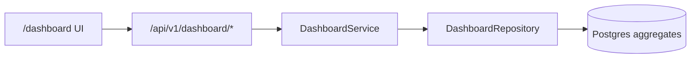

# Dashboard Architecture

## Overview

The VoxForge Dashboard provides org-scoped analytics and a web UI for monitoring voice AI operations.

## Web UI

Open **http://localhost:8000/dashboard** after starting the server.

1. Register/login via `/api/v1/auth/register` or `/api/v1/auth/login`
2. Paste the JWT access token into the dashboard connect bar
3. View overview, sessions, latency, evaluations, and activity

Static assets live in `dashboard/` at the project root.

## API Endpoints

| Method | Path | Description |
|--------|------|-------------|
| GET | `/api/v1/dashboard/overview` | Org-level KPIs |
| GET | `/api/v1/dashboard/sessions` | Recent sessions with stats |
| GET | `/api/v1/dashboard/latency` | Latency breakdown by metric |
| GET | `/api/v1/dashboard/evaluations` | Evaluation pass/warn/fail summary |
| GET | `/api/v1/dashboard/activity` | Recent sessions, tools, evaluations |

All endpoints require JWT with `sessions:read` scope.

## Data Sources

Aggregates from existing tables:
- `voice_sessions`, `messages`, `session_metrics`
- `tool_calls`, `evaluation_runs`, `evaluation_metrics`

No additional migrations required.
