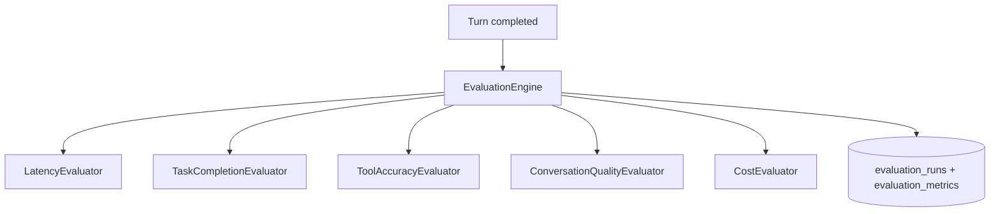

# Evaluation Engine Architecture

## Overview

The Evaluation Engine scores every voice turn across **latency**, **task completion**, **tool accuracy**, **conversation quality**, and **cost**.



## Metrics

| Metric | Scoring |
|--------|---------|
| `latency` | 1.0 if e2e ≤ target; degrades above `EVALUATION_E2E_TARGET_MS` |
| `task_completion` | 1.0 if assistant responded; 0.3 if interrupted |
| `tool_accuracy` | Ratio of successful tool calls |
| `conversation_quality` | Heuristic on response length |
| `cost` | Estimated USD vs turn budget |

Overall score = average of all metric scores. Status: `passed` (≥0.8 all), `warning`, or `failed`.

## API

| Method | Path | Description |
|--------|------|-------------|
| GET | `/api/v1/sessions/{id}/evaluations` | List turn evaluations |
| GET | `/api/v1/evaluations/{run_id}` | Single evaluation run |

## Configuration

```env
EVALUATION_ENABLED=true
EVALUATION_E2E_TARGET_MS=2000
EVALUATION_LLM_INPUT_COST_PER_1K=0.00015
EVALUATION_LLM_OUTPUT_COST_PER_1K=0.0006
EVALUATION_TURN_COST_BUDGET_USD=0.01
```

## Prometheus

- `voxforge_evaluation_runs_total{status}`
- `voxforge_evaluation_score` histogram

## Future improvements

- LLM-as-judge for hallucination detection
- Speech quality scoring (WER vs transcript)
- Regression test harness with golden datasets
- CI quality gates
