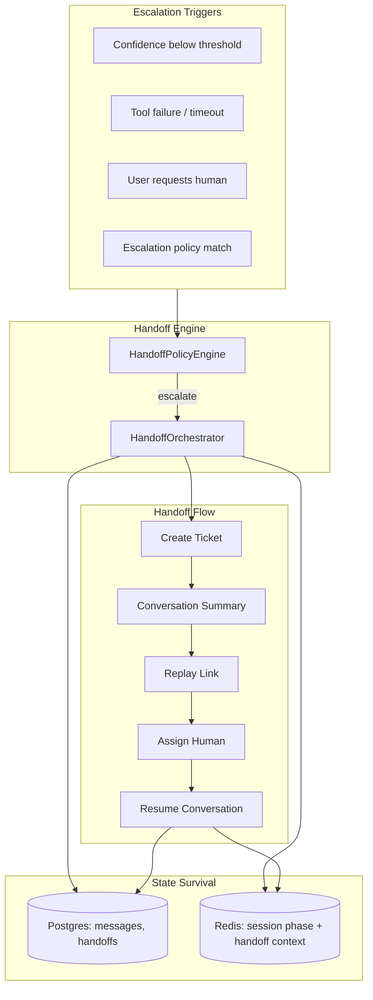
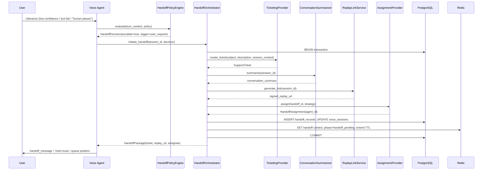
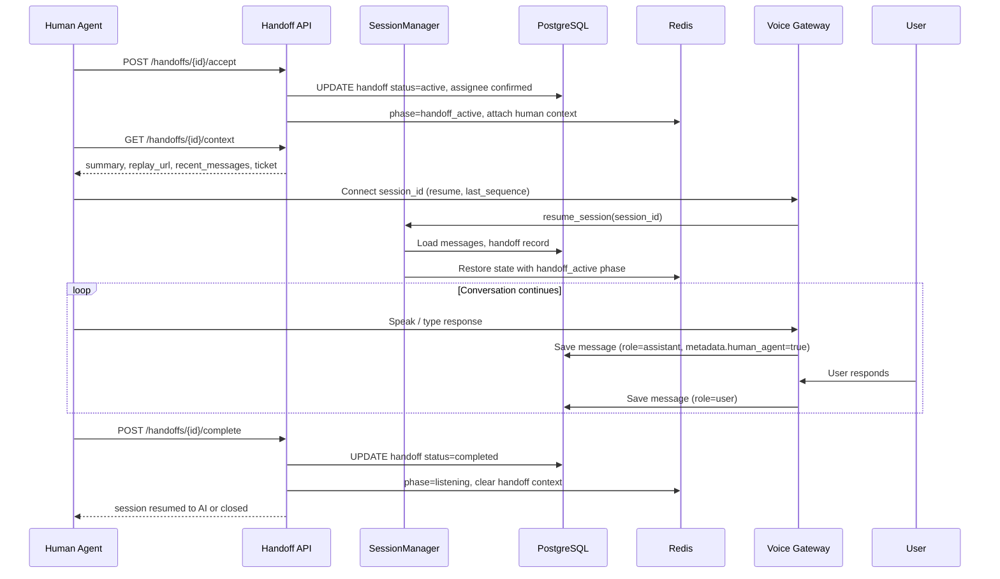
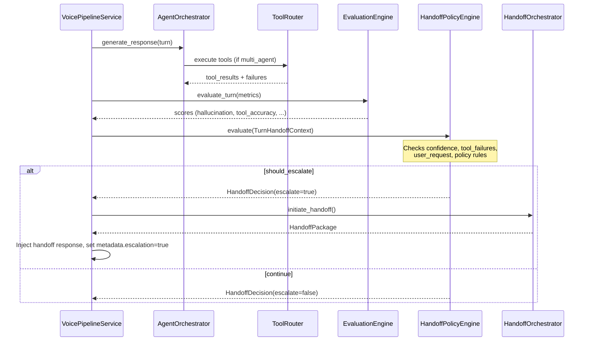

# Enterprise Human Handoff Architecture

## Overview

The Human Handoff module provides **runtime escalation orchestration** from the voice agent to a human operator. It unifies four escalation triggers — confidence thresholds, tool failures, explicit user requests, and org-configurable policies — into a single flow that creates a ticket, packages conversation context, generates a replay link, assigns a human, and preserves session state for seamless resume.



## Design principles

| Principle | Implementation |
|-----------|----------------|
| **Conversation state survives** | Session stays `active`; messages in Postgres; Redis handoff context with extended TTL |
| **Single orchestrated flow** | `HandoffOrchestrator` coordinates ticket + summary + replay + assignment atomically |
| **Policy-driven** | Org-level `EscalationPolicy` from agent config / support templates |
| **Observable** | Metrics, traces, and replay events on every handoff stage |
| **No vendor lock-in** | `TicketingProvider` and `AssignmentProvider` ports (mock, Zendesk, Freshdesk, internal queue) |
| **Idempotent** | Duplicate trigger on same session returns existing handoff record |

## Escalation triggers

### 1. Confidence thresholds

Composite confidence score computed per turn from signals already in the pipeline:

| Signal | Source | Weight (default) |
|--------|--------|------------------|
| Critic approval | `agent_trace.critic.approved` | 0.30 |
| Hallucination score | `EvaluationEngine` hallucination metric | 0.25 |
| Tool success ratio | `agent_trace.tool` steps | 0.20 |
| STT confidence | `user_metadata.confidence` (Deepgram) | 0.15 |
| KB retrieval similarity | `knowledge_base_lookup` top result | 0.10 |

```python
confidence = weighted_mean(signals)
escalate if confidence < policy.min_confidence  # default 0.55
```

High-touch preset (`high-touch-escalation`) uses `min_confidence=0.70`; strict compliance uses `0.80`.

### 2. Tool failure

Escalate when:

- Any tool returns `ERROR` or `TIMEOUT` status, **and** `policy.escalate_on_tool_failure=true`
- **Or** `consecutive_tool_failures >= policy.max_tool_failures` (default 2) within the session
- **Or** critical tools fail (`knowledge_base_lookup`, `ticket_lookup`) with `policy.escalate_on_critical_tool_failure=true`

Hook point: `ToolRouter.execute()` post-execution + `AgentOrchestrator` executor loop.

### 3. User request

Escalate when user transcript matches intent patterns:

| Pattern class | Examples |
|---------------|----------|
| Explicit human | "speak to a human", "real person", "agent please" |
| Frustration | "this isn't working", "I've tried everything" |
| Transfer | "transfer me", "escalate this" |

Detection via `UserRequestDetector` (keyword + optional lightweight classifier). Respects `policy.require_explicit_request` (strict preset: only explicit phrases).

### 4. Escalation policies

Org-level policy loaded from active `agent_config_versions` or `support_templates`:

```json
{
  "fallback_to_human": true,
  "min_confidence": 0.55,
  "escalate_on_tool_failure": true,
  "max_tool_failures": 2,
  "escalate_on_critical_tool_failure": true,
  "require_explicit_request": false,
  "auto_create_ticket": true,
  "assignment_strategy": "round_robin",
  "handoff_message": "I'm connecting you with a specialist who can help further."
}
```

`HandoffPolicyEngine.evaluate()` returns `HandoffDecision(should_escalate, trigger, confidence, reason)`.

## Handoff flow (sequence diagrams)

### End-to-end handoff



### Human resume conversation



### Policy evaluation (per turn)



## Module layout

```
src/voxforge/
├── core/
│   ├── domain/handoff.py              # HandoffRecord, EscalationPolicy, HandoffDecision
│   └── interfaces/handoff.py          # HandoffOrchestrator, AssignmentProvider ports
├── modules/handoff/
│   └── application/
│       ├── policy.py                  # HandoffPolicyEngine, UserRequestDetector
│       ├── orchestrator.py            # HandoffOrchestrator (ticket + summary + replay + assign)
│       ├── summarizer.py              # Conversation summary for human context
│       └── replay_link.py             # Signed replay URL generation
├── infrastructure/
│   ├── db/handoff_repository.py
│   ├── providers/handoff/
│   │   ├── mock_assignment.py
│   │   └── round_robin.py
│   └── tools/handoff_tools.py         # handoff_to_human tool
└── api/v1/handoffs.py                 # REST API for human agents
```

## Database changes (migration 011)

### New tables

```sql
-- Migration 011_human_handoff.py

CREATE TABLE handoff_records (
    id UUID PRIMARY KEY,
    org_id UUID NOT NULL REFERENCES organizations(id),
    session_id UUID NOT NULL REFERENCES voice_sessions(id),
    ticket_id VARCHAR(128),
    ticket_provider VARCHAR(32) NOT NULL DEFAULT 'mock',
    status VARCHAR(32) NOT NULL DEFAULT 'pending',
    -- pending | assigned | active | completed | cancelled
    trigger VARCHAR(64) NOT NULL,
    -- confidence_threshold | tool_failure | user_request | policy
    trigger_reason TEXT,
    confidence_score FLOAT,
    conversation_summary TEXT,
    replay_url VARCHAR(2048),
    replay_token VARCHAR(128),
    assigned_to_user_id UUID REFERENCES users(id),
    assigned_to_email VARCHAR(255),
    assigned_at TIMESTAMPTZ,
    accepted_at TIMESTAMPTZ,
    completed_at TIMESTAMPTZ,
    metadata JSONB NOT NULL DEFAULT '{}',
    created_at TIMESTAMPTZ NOT NULL DEFAULT now(),
    updated_at TIMESTAMPTZ NOT NULL DEFAULT now(),
    UNIQUE (session_id)  -- one active handoff per session
);

CREATE INDEX idx_handoff_records_org_status ON handoff_records(org_id, status);
CREATE INDEX idx_handoff_records_assigned ON handoff_records(assigned_to_user_id, status);

CREATE TABLE handoff_events (
    id UUID PRIMARY KEY,
    handoff_id UUID NOT NULL REFERENCES handoff_records(id) ON DELETE CASCADE,
    org_id UUID NOT NULL,
    event_type VARCHAR(64) NOT NULL,
    -- created | ticket_created | summary_generated | replay_linked |
    -- assigned | accepted | resumed | message | completed | cancelled
    payload JSONB NOT NULL DEFAULT '{}',
    created_at TIMESTAMPTZ NOT NULL DEFAULT now()
);

CREATE INDEX idx_handoff_events_handoff ON handoff_events(handoff_id, created_at);

CREATE TABLE conversation_snapshots (
    id UUID PRIMARY KEY,
    handoff_id UUID NOT NULL REFERENCES handoff_records(id) ON DELETE CASCADE,
    session_id UUID NOT NULL,
    org_id UUID NOT NULL,
    message_count INT NOT NULL,
    snapshot JSONB NOT NULL,  -- serialized messages + memory summary + agent_trace refs
    created_at TIMESTAMPTZ NOT NULL DEFAULT now()
);
```

### Existing table changes

```sql
-- voice_sessions: add handoff tracking
ALTER TABLE voice_sessions
    ADD COLUMN handoff_id UUID REFERENCES handoff_records(id),
    ADD COLUMN handoff_status VARCHAR(32);

-- Extend session status enum (application layer)
-- SessionStatus: add HANDOFF_PENDING, HANDOFF_ACTIVE

-- SessionPhase (Redis): add HANDOFF_PENDING, HANDOFF_ACTIVE

-- tool_calls: link to handoff
ALTER TABLE tool_calls
    ADD COLUMN handoff_id UUID REFERENCES handoff_records(id);

-- outcome_kpis: link to handoff record
ALTER TABLE outcome_kpis
    ADD COLUMN handoff_id UUID REFERENCES handoff_records(id);
```

### Conversation state survival model

| Layer | On handoff | On resume | On complete |
|-------|------------|-----------|-------------|
| **Postgres `messages`** | Preserved; new messages tagged `metadata.human_agent=true` | Human reads full history | Continues appending |
| **Postgres `handoff_records`** | Created with summary + replay URL | Status → `active` | Status → `completed` |
| **`conversation_snapshots`** | Point-in-time freeze at handoff initiation | Reference for audit | Immutable |
| **Redis `SessionState`** | `phase=handoff_pending`, handoff context in `config.handoff` | `phase=handoff_active` | `phase=listening` or session ended |
| **Redis TTL** | Extended to `handoff_session_ttl_seconds` (default 4h) | Refreshed on human heartbeat | Restored to default |
| **Orchestrator history** | Frozen snapshot in `conversation_snapshots` | Reloaded from Postgres on resume | Continues from DB |
| **Memory entries** | Preserved; included in summary | Available for context | Unchanged |

## API endpoints (proposed)

| Method | Path | Scope | Description |
|--------|------|-------|-------------|
| POST | `/api/v1/sessions/{id}/handoff` | `sessions:write` | Initiate handoff (internal/agent triggered) |
| GET | `/api/v1/handoffs/{id}` | `handoffs:read` | Handoff status + package |
| GET | `/api/v1/handoffs` | `handoffs:read` | List org handoffs (filter by status) |
| POST | `/api/v1/handoffs/{id}/accept` | `handoffs:write` | Human agent accepts assignment |
| GET | `/api/v1/handoffs/{id}/context` | `handoffs:read` | Summary, messages, replay link, ticket |
| POST | `/api/v1/handoffs/{id}/complete` | `handoffs:write` | Mark handoff complete, resume or close |
| POST | `/api/v1/handoffs/{id}/cancel` | `handoffs:write` | Cancel pending handoff |
| GET | `/api/v1/replay/{token}` | `handoffs:read` | Token-based replay (for ticket links) |

### New RBAC scopes

| Scope | Roles |
|-------|-------|
| `handoffs:read` | owner, admin, member (assigned agent) |
| `handoffs:write` | owner, admin, member (assigned agent) |
| `handoffs:assign` | owner, admin |

## Tools

### `handoff_to_human` (new)

Replaces ad-hoc `ticket_create` + phrase-based escalation. Single tool the agent calls when policy engine or LLM decides to escalate.

```json
{
  "name": "handoff_to_human",
  "parameters": {
    "reason": "string — why escalating",
    "priority": "low|normal|high|urgent",
    "customer_email": "optional string"
  }
}
```

Internally delegates to `HandoffOrchestrator.initiate_handoff()` — does **not** call `ticket_create` separately.

## Integration points

### Voice pipeline

`/Users/brohammad/projects/VoxForge/src/voxforge/modules/voice_gateway/application/pipeline.py`

After turn evaluation, call `HandoffPolicyEngine.evaluate()`. If escalate, invoke orchestrator before TTS response (or override response with `policy.handoff_message`).

### Agent orchestrator

`/Users/brohammad/projects/VoxForge/src/voxforge/modules/agent_orchestrator/application/graph.py`

Executor loop: track consecutive tool failures. Critic rejection + low confidence → suggest `handoff_to_human` tool call.

### Outcomes

`/Users/brohammad/projects/VoxForge/src/voxforge/modules/outcomes/application/service.py`

Extend `_derive_escalation()` to check `handoff_records` for session (authoritative source post-implementation).

### Replay

`/Users/brohammad/projects/VoxForge/src/voxforge/infrastructure/db/replay_repository.py`

Add `handoff` event type to timeline from `handoff_events` table.

### Evaluation

Hallucination and tool_accuracy scores feed `HandoffPolicyEngine` confidence composite. Handoff itself recorded as evaluation context.

### Dashboard

New **Handoffs** queue panel: pending assignments, accept button, context drawer with replay embed.

## Observability

### Prometheus metrics

| Metric | Type | Labels | Description |
|--------|------|--------|-------------|
| `voxforge_handoff_initiated_total` | Counter | `trigger`, `org_id` | Handoffs started by trigger type |
| `voxforge_handoff_completed_total` | Counter | `status` | completed, cancelled, expired |
| `voxforge_handoff_duration_seconds` | Histogram | `stage` | Time per stage (ticket, summary, assign) |
| `voxforge_handoff_time_to_accept_seconds` | Histogram | — | Initiation → human accept |
| `voxforge_handoff_time_to_resolve_seconds` | Histogram | — | Accept → complete |
| `voxforge_handoff_queue_depth` | Gauge | `org_id` | Pending unassigned handoffs |
| `voxforge_handoff_confidence_at_escalation` | Histogram | `trigger` | Confidence score when escalated |
| `voxforge_handoff_resume_total` | Counter | `status` | Session resume attempts |

### OpenTelemetry spans

| Span | Attributes |
|------|------------|
| `handoff.policy.evaluate` | `confidence`, `trigger`, `should_escalate` |
| `handoff.orchestrate` | `session_id`, `handoff_id`, `trigger` |
| `handoff.ticket.create` | `ticket_id`, `provider` |
| `handoff.summary.generate` | `message_count`, `summary_length` |
| `handoff.replay.link` | `replay_url` (redacted token) |
| `handoff.assign` | `assignee_id`, `strategy` |
| `handoff.resume` | `session_id`, `last_sequence` |
| `handoff.complete` | `resolution`, `duration_seconds` |

### Structured log events

```json
{
  "event": "handoff_initiated",
  "handoff_id": "uuid",
  "session_id": "uuid",
  "org_id": "uuid",
  "trigger": "tool_failure",
  "confidence": 0.42,
  "ticket_id": "TKT-1042"
}
```

### Grafana dashboard panels

- Handoff rate by trigger type (stacked bar)
- Queue depth over time
- p95 time-to-accept and time-to-resolve
- Confidence distribution at escalation
- Handoff completion rate

### Alert integration

Extend `AlertService` with:

| Alert code | Trigger |
|------------|---------|
| `handoff_queue_backlog` | `handoff_queue_depth > handoff_queue_max` (default 10) |
| `handoff_sla_breach` | `time_to_accept > handoff_accept_sla_seconds` (default 300) |

## Configuration

```env
HANDOFF_ENABLED=true
HANDOFF_AUTO_POLICY=true
HANDOFF_MIN_CONFIDENCE=0.55
HANDOFF_MAX_TOOL_FAILURES=2
HANDOFF_ESCALATE_ON_TOOL_FAILURE=true
HANDOFF_SESSION_TTL_SECONDS=14400
HANDOFF_ACCEPT_SLA_SECONDS=300
HANDOFF_QUEUE_MAX=10
HANDOFF_ASSIGNMENT_PROVIDER=mock
HANDOFF_REPLAY_TOKEN_TTL_SECONDS=604800
PUBLIC_BASE_URL=https://app.voxforge.io
```

`PUBLIC_BASE_URL` (already in `config.py`) is used for replay link generation:

```
{PUBLIC_BASE_URL}/dashboard#replay={session_id}&token={signed_token}
```

## Testing strategy

| Layer | File | Focus |
|-------|------|-------|
| Unit | `tests/unit/test_handoff_policy.py` | Policy engine, triggers, confidence |
| Unit | `tests/unit/test_handoff_tools.py` | `handoff_to_human` tool contract |
| Integration | `tests/integration/test_handoff.py` | Full flow, state survival, resume |
| Integration | `tests/integration/test_handoff_observability.py` | Metrics and replay events |

## Implementation phases

| Phase | Scope |
|-------|-------|
| **1** | Domain, policy engine, migration 011, repository |
| **2** | HandoffOrchestrator, replay links, `handoff_to_human` tool |
| **3** | Pipeline integration, session phase transitions |
| **4** | Human agent API, assignment provider, dashboard queue |
| **5** | Zendesk/Freshdesk ticket context passthrough, SLA alerts |

## Open questions (for review)

1. **AI pause during handoff** — Mute agent entirely, or co-pilot mode where AI suggests responses?
2. **Session uniqueness** — One handoff per session (proposed) or allow re-escalation?
3. **Replay link auth** — Signed token (proposed) vs org-scoped API key?
4. **Assignment routing** — Round-robin (v1) vs skill-based queues?
5. **Single orchestrator mode** — Enable `handoff_to_human` in `single` mode via forced tool injection from policy engine?

## Related docs

- [ADR-006: Enterprise Human Handoff](../adr/ADR-006-human-handoff.md)
- [Customer Support Tools](./customer-support-tools.md)
- [Session Replay](./replay.md)
- [Outcomes](./outcomes.md)
- [Agent Config Versioning](./agent-config-versioning.md)
- [Observability](./observability.md)
