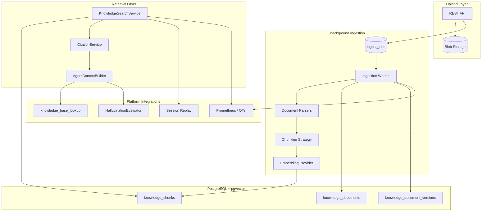
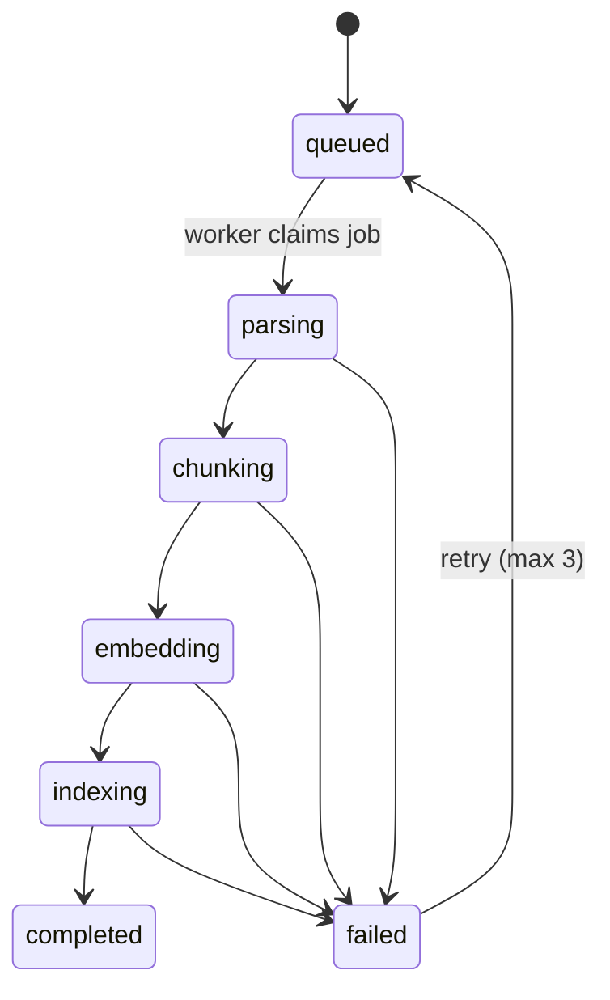

# Enterprise Knowledge Base Architecture

## Overview

The Knowledge Base module extends VoxForge with **org-scoped document ingestion**, **semantic retrieval**, **citation generation**, and **agent context injection**. It reuses existing pgvector, embedding provider ports, evaluation/replay/observability plumbing, and the `KnowledgeBaseProvider` interface already consumed by `knowledge_base_lookup`.



## Design principles

| Principle | Implementation |
|-----------|----------------|
| **Multi-tenant** | Every table carries `org_id`; all queries filter by authenticated principal's org |
| **No vendor lock-in** | Ports for parsers, embeddings, blob storage, chunking; pgvector is Postgres-native |
| **Incremental updates** | Content-hash diffing; only changed chunks re-embedded |
| **Versioning** | Immutable `knowledge_document_versions`; active version pointer on document |
| **Observability-first** | Metrics, traces, and audit events on every ingest/search path |
| **Evaluation-ready** | Retrieved chunks flow to hallucination judge as `context_snippets` with citation metadata |

## Module layout

```
src/voxforge/
├── core/
│   ├── domain/knowledge.py          # Document, Chunk, Citation, IngestJob models
│   └── interfaces/knowledge.py      # Parser, Chunker, VectorStore, BlobStore ports
├── modules/knowledge/
│   └── application/
│       ├── ingestion_service.py     # Job orchestration, versioning, re-index
│       ├── search_service.py        # Semantic search + filters
│       ├── citation_service.py      # Citation assembly
│       └── context_builder.py       # Agent prompt injection
├── infrastructure/
│   ├── knowledge/
│   │   ├── parsers/                 # pdf, markdown, html, txt, csv adapters
│   │   ├── chunking/                # recursive, fixed, semantic strategies
│   │   ├── blob/                    # filesystem (dev), s3-compatible (prod)
│   │   └── worker.py                # Background ingestion loop
│   └── db/
│       ├── knowledge_repository.py  # pgvector CRUD + search
│       └── models.py                # SQLAlchemy models (extended)
└── api/v1/knowledge.py              # REST endpoints
```

## Pipeline stages

### 1. Upload

| Input | Handling |
|-------|----------|
| PDF | `pypdf` parser → text + page metadata |
| Markdown | `markdown-it` or stdlib → preserve headings as metadata |
| HTML | `beautifulsoup4` → strip scripts/styles, extract text + title |
| TXT | Direct UTF-8 decode |
| CSV | Row-aware chunking; header preserved in chunk metadata |

**API endpoints (proposed):**

| Method | Path | Scope | Description |
|--------|------|-------|-------------|
| POST | `/api/v1/knowledge/collections` | `knowledge:write` | Create collection |
| GET | `/api/v1/knowledge/collections` | `knowledge:read` | List org collections |
| POST | `/api/v1/knowledge/collections/{id}/documents` | `knowledge:write` | Upload document (multipart) |
| GET | `/api/v1/knowledge/documents/{id}` | `knowledge:read` | Document metadata + versions |
| GET | `/api/v1/knowledge/documents/{id}/jobs` | `knowledge:read` | Ingestion progress |
| POST | `/api/v1/knowledge/documents/{id}/reindex` | `knowledge:write` | Force full re-index |
| POST | `/api/v1/knowledge/search` | `knowledge:read` | Semantic search with citations |

**Blob storage:** Files stored at `{org_id}/{document_id}/{version}/{filename}` via `BlobStore` port. Dev uses local filesystem; production uses S3-compatible object storage without binding to a single vendor.

### 2. Chunking

`ChunkingStrategy` port with configurable parameters per collection:

| Strategy | Use case | Parameters |
|----------|----------|------------|
| `recursive` | General text (default) | `chunk_size`, `chunk_overlap`, separators |
| `fixed` | Uniform segments | `chunk_size`, `chunk_overlap` |
| `row` | CSV | `rows_per_chunk`, `include_header` |
| `page` | PDF | One chunk per page (optional mode) |

Each chunk carries metadata:

```json
{
  "document_id": "uuid",
  "version": 3,
  "chunk_index": 12,
  "page": 4,
  "heading": "Refund Policy",
  "row_start": 100,
  "row_end": 120,
  "source_type": "pdf"
}
```

### 3. Embedding

Reuses `EmbeddingProvider` from `core/interfaces/memory.py`. Factory extended:

```env
EMBEDDING_PROVIDER=openai    # openai | local | mock
EMBEDDING_MODEL=text-embedding-3-small
EMBEDDING_DIMENSIONS=1536
```

Batch embedding via `embed_batch()` to minimize API round-trips. Dimension stored on collection for validation.

### 4. pgvector storage

Migration `010_knowledge_base.py` (proposed):

```sql
CREATE TABLE knowledge_collections (
    id UUID PRIMARY KEY,
    org_id UUID NOT NULL REFERENCES organizations(id),
    name VARCHAR(255) NOT NULL,
    embedding_dimensions INT NOT NULL DEFAULT 1536,
    chunking_config JSONB NOT NULL DEFAULT '{}',
    created_at TIMESTAMPTZ NOT NULL DEFAULT now(),
    UNIQUE (org_id, name)
);

CREATE TABLE knowledge_documents (
    id UUID PRIMARY KEY,
    org_id UUID NOT NULL,
    collection_id UUID NOT NULL REFERENCES knowledge_collections(id),
    title VARCHAR(512) NOT NULL,
    source_type VARCHAR(32) NOT NULL,  -- pdf|markdown|html|txt|csv
    content_hash VARCHAR(64) NOT NULL, -- SHA-256 of normalized text
    active_version_id UUID,
    status VARCHAR(32) NOT NULL DEFAULT 'pending',
    created_at TIMESTAMPTZ NOT NULL DEFAULT now(),
    updated_at TIMESTAMPTZ NOT NULL DEFAULT now()
);

CREATE TABLE knowledge_document_versions (
    id UUID PRIMARY KEY,
    document_id UUID NOT NULL REFERENCES knowledge_documents(id),
    version_number INT NOT NULL,
    content_hash VARCHAR(64) NOT NULL,
    blob_path VARCHAR(1024) NOT NULL,
    chunk_count INT NOT NULL DEFAULT 0,
    metadata JSONB NOT NULL DEFAULT '{}',
    created_at TIMESTAMPTZ NOT NULL DEFAULT now(),
    UNIQUE (document_id, version_number)
);

CREATE TABLE knowledge_chunks (
    id UUID PRIMARY KEY,
    org_id UUID NOT NULL,
    document_version_id UUID NOT NULL REFERENCES knowledge_document_versions(id),
    chunk_index INT NOT NULL,
    content TEXT NOT NULL,
    content_hash VARCHAR(64) NOT NULL,
    token_count INT,
    metadata JSONB NOT NULL DEFAULT '{}',
    embedding JSONB,
    embedding_vec vector(1536),
    created_at TIMESTAMPTZ NOT NULL DEFAULT now()
);

CREATE INDEX idx_knowledge_chunks_org ON knowledge_chunks(org_id);
CREATE INDEX idx_knowledge_chunks_version ON knowledge_chunks(document_version_id);
CREATE INDEX idx_knowledge_chunks_embedding
    ON knowledge_chunks USING hnsw (embedding_vec vector_cosine_ops);

CREATE TABLE knowledge_ingest_jobs (
    id UUID PRIMARY KEY,
    org_id UUID NOT NULL,
    document_id UUID NOT NULL REFERENCES knowledge_documents(id),
    document_version_id UUID REFERENCES knowledge_document_versions(id),
    job_type VARCHAR(32) NOT NULL,  -- ingest|reindex|incremental
    status VARCHAR(32) NOT NULL DEFAULT 'queued',
    progress_pct INT NOT NULL DEFAULT 0,
    stage VARCHAR(64),
    error_message TEXT,
    started_at TIMESTAMPTZ,
    completed_at TIMESTAMPTZ,
    created_at TIMESTAMPTZ NOT NULL DEFAULT now()
);
```

**Org isolation:** All repository methods require `org_id` from `Principal`. Cross-org document access returns 404.

### 5. Semantic search

`KnowledgeSearchService.search()`:

1. Embed query via `EmbeddingProvider`
2. pgvector cosine search filtered by `org_id` + optional `collection_id`
3. Apply `min_similarity` threshold (default 0.65, aligned with memory module)
4. Return ranked `KnowledgeChunkResult` with similarity scores

**Hybrid search (future):** BM25 via Postgres full-text on `content` combined with vector score — not in v1.

### 6. Citation generation

`CitationService` produces structured citations:

```json
{
  "chunk_id": "uuid",
  "document_id": "uuid",
  "document_title": "Employee Handbook",
  "version": 2,
  "source_type": "pdf",
  "page": 14,
  "heading": "PTO Policy",
  "excerpt": "Employees accrue 15 days...",
  "similarity": 0.87,
  "citation_label": "[Employee Handbook p.14]"
}
```

Citation labels are injected into agent context and stored in tool call payloads for replay.

### 7. Agent context

`KnowledgeContextBuilder` assembles retrieved chunks for:

- **`knowledge_base_lookup` tool** — via `InternalKnowledgeBaseProvider` implementing existing `KnowledgeBaseProvider` port
- **Voice pipeline** — optional pre-turn retrieval when `KNOWLEDGE_CONTEXT_ENABLED=true`
- **HallucinationEvaluator** — `context_snippets` include chunk text + citation labels

Context format (aligned with `ContextBuilder` memory style):

```
Relevant knowledge base excerpts:
- [Employee Handbook p.14] (relevance 0.87): Employees accrue 15 days...
- [Refund Policy §2.1] (relevance 0.82): Refunds within 30 days...
```

## Background ingestion

No Celery/RQ dependency. Uses **Postgres-backed job queue** polled by an asyncio worker:



**Worker deployment:** Separate process profile in `docker-compose.prod.yml` (same pattern as LiveKit worker):

```bash
python -m voxforge.infrastructure.knowledge.worker
```

**Progress tracking:** `knowledge_ingest_jobs.progress_pct` and `stage` updated at each pipeline step. Clients poll `GET /documents/{id}/jobs/{job_id}`.

## Versioning and incremental updates

| Scenario | Behavior |
|----------|----------|
| **New upload, same hash** | Skip ingestion; return existing version |
| **New upload, different hash** | Create version N+1; diff chunks by `content_hash` |
| **Incremental** | Delete removed chunks; embed only new/changed chunks |
| **Re-index** | New job type `reindex`; re-embed all chunks (e.g., model change) |
| **Rollback** | Set `active_version_id` to prior version; search uses active version only |

## Multi-tenancy and RBAC

New scopes in `ROLE_SCOPES`:

| Scope | Roles |
|-------|-------|
| `knowledge:read` | owner, admin, member |
| `knowledge:write` | owner, admin |
| `knowledge:delete` | owner, admin |

Audit log entries for upload, delete, re-index operations.

## Provider abstractions

```python
# core/interfaces/knowledge.py (summary)

class DocumentParser(Protocol):
    async def parse(self, content: bytes, *, source_type: SourceType) -> ParsedDocument: ...

class ChunkingStrategy(Protocol):
    def chunk(self, document: ParsedDocument, *, config: ChunkingConfig) -> list[RawChunk]: ...

class BlobStore(Protocol):
    async def put(self, key: str, data: bytes) -> str: ...
    async def get(self, key: str) -> bytes: ...
    async def delete(self, key: str) -> None: ...

class KnowledgeChunkStore(Protocol):
    async def upsert_chunks(self, *, org_id, version_id, chunks) -> int: ...
    async def search_similar(self, *, org_id, query_embedding, ...) -> list[ChunkSearchResult]: ...
    async def delete_by_version(self, version_id: UUID) -> int: ...
```

`EmbeddingProvider` is reused from memory module. `KnowledgeBaseProvider` (support port) gains `InternalKnowledgeBaseProvider` adapter backed by `KnowledgeSearchService`.

## Integration with Evaluation, Replay, Observability

### Evaluation

| Integration point | Behavior |
|-------------------|----------|
| `HallucinationEvaluator` | `context_snippets` populated from KB retrieval citations |
| `ToolAccuracyEvaluator` | KB tool results include `citation_count` in trace |
| New metric: `knowledge_grounding` | Score = citations used / claims made (future) |

### Replay

Session replay timeline includes:

- `knowledge_retrieval` events with query, chunk IDs, similarity scores
- `tool_call` payloads for `knowledge_base_lookup` include full citation objects
- Ingest job events linked to org audit trail (not session-scoped)

### Observability

| Signal | Name | Labels |
|--------|------|--------|
| Counter | `voxforge_knowledge_ingest_jobs_total` | `status`, `source_type` |
| Histogram | `voxforge_knowledge_ingest_duration_seconds` | `stage` |
| Histogram | `voxforge_knowledge_search_latency_seconds` | `collection_id` |
| Counter | `voxforge_knowledge_chunks_indexed_total` | `org_id` (cardinality-bounded via collection) |
| Gauge | `voxforge_knowledge_ingest_queue_depth` | — |
| Span | `knowledge.ingest`, `knowledge.search`, `knowledge.citation` | `org_id`, `document_id` |

Grafana dashboard panel group: **Knowledge Base** (ingest throughput, search p95, error rate).

## Configuration

```env
KNOWLEDGE_ENABLED=true
KNOWLEDGE_BLOB_STORE=filesystem       # filesystem | s3
KNOWLEDGE_BLOB_PATH=/data/knowledge
KNOWLEDGE_WORKER_ENABLED=true
KNOWLEDGE_WORKER_POLL_INTERVAL_SEC=2
KNOWLEDGE_DEFAULT_CHUNK_SIZE=512
KNOWLEDGE_DEFAULT_CHUNK_OVERLAP=64
KNOWLEDGE_SEARCH_TOP_K=5
KNOWLEDGE_SEARCH_MIN_SIMILARITY=0.65
KNOWLEDGE_CONTEXT_ENABLED=true
KNOWLEDGE_BASE_PROVIDER=internal    # internal | mock | zendesk | freshdesk

# S3-compatible (optional)
KNOWLEDGE_S3_ENDPOINT=
KNOWLEDGE_S3_BUCKET=
KNOWLEDGE_S3_ACCESS_KEY=
KNOWLEDGE_S3_SECRET_KEY=
```

## Dependencies (proposed additions to pyproject.toml)

| Package | Purpose |
|---------|---------|
| `pypdf` | PDF text extraction |
| `beautifulsoup4` | HTML parsing |
| `markdown-it-py` | Markdown parsing |
| `tiktoken` | Token counting for chunk sizing |

No LangChain document loaders — parsers are thin adapters behind ports.

## Testing strategy

| Layer | Location | Focus |
|-------|----------|-------|
| Domain | `tests/unit/test_knowledge_base_domain.py` | Citation labels, version logic, chunk metadata |
| Parsers | `tests/unit/test_knowledge_parsers.py` | Format-specific extraction |
| Repository | `tests/integration/test_knowledge_base_search.py` | pgvector search, org isolation |
| Ingestion | `tests/integration/test_knowledge_base_ingestion.py` | Full pipeline with mock embedder |
| API | `tests/integration/test_knowledge_api.py` | Upload, search, job polling |
| Contract | `tests/unit/test_knowledge_provider_adapter.py` | `InternalKnowledgeBaseProvider` ↔ support port |

## Benchmarks

See [Knowledge Base Benchmarks](../benchmarks/knowledge-base.md). Script: `scripts/benchmark_knowledge_base.py`.

Targets (engineering, mock providers, 10k chunks):

| Metric | Target |
|--------|--------|
| Ingest (1 MB PDF) | < 30 s excluding embedding API |
| Search p95 | < 100 ms excluding embedding API |
| Citation assembly | < 5 ms |

## Migration path from mock KB

1. Deploy schema + worker with `KNOWLEDGE_BASE_PROVIDER=internal`
2. `InternalKnowledgeBaseProvider` replaces `MockKnowledgeBaseProvider` in factory
3. Existing `knowledge_base_lookup` tool unchanged — adapter swap only
4. Upload enterprise docs via API or dashboard
5. Zendesk/Freshdesk adapters remain available for hybrid deployments

## Related docs

- [ADR-005: Enterprise Knowledge Base](../adr/ADR-005-enterprise-knowledge-base.md)
- [Customer Support Tools](./customer-support-tools.md)
- [Memory Architecture](./memory.md)
- [Evaluation Engine](./evaluation-engine.md)
- [Replay](./replay.md)
- [Observability](./observability.md)

## Open questions (for review)

1. **Dashboard UI scope** — upload UI in v1 or API-only?
2. **Collection-level access** — org-wide vs per-collection RBAC?
3. **HNSW index** — create at migration time or after first N chunks?
4. **Worker scaling** — single worker sufficient for v1?
5. **File size limits** — 50 MB default cap per document?
