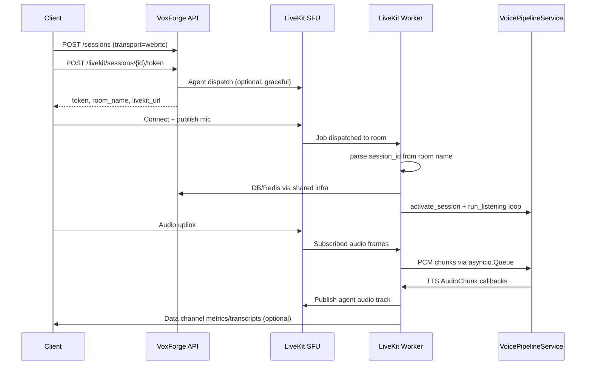

# LiveKit Integration Architecture

Phase 4 transport adapter wiring LiveKit WebRTC rooms into the existing production voice
pipeline. LiveKit is **not** a separate voice stack.

## System context

```text
Browser / Client SDK
        │
        ▼
LiveKit Cloud (or self-hosted SFU)
        │
        ▼
LiveKit Worker  ──transport──▶  VoicePipelineService
        │                              │
        │                              ▼
        │                    Conversation Engine
        │                              │
        │                              ▼
        │                    Agent Orchestrator
        │                              │
        │                              ▼
        │                              MCP
        │                              │
        │                              ▼
        │                         Evaluation
        │                              │
        │                              ▼
        │                           Replay
        ▼
SessionManager (Postgres + Redis)
```

WebSocket clients continue to use `POST /api/v1/ws/voice` with identical pipeline semantics.

## Session lifecycle



### States

| Event | SessionManager | Worker |
|-------|----------------|--------|
| Token issued | Session exists (`created`/`active`) | Dispatch attempted |
| Worker joins | `activate_session` | Publishes agent audio track |
| User speaks | `listening` → `processing` → `speaking` | Ingress + pipeline turn |
| Barge-in | `set_interrupt` | `pipeline.interrupt()` |
| Participant leaves | Heartbeats stop | Grace timer starts |
| Rejoin within grace | `resume_session` | Continue job |
| Grace expired | `end_session` | Worker exits |

## Transport sequence (audio path)

```text
Remote audio track
    → rtc.AudioStream (16 kHz mono)
    → frame_to_pipeline_pcm()
    → asyncio.Queue
    → VoicePipelineService.run_listening()
    → STT stream → _process_turn()
    → on_audio(AudioChunk)
    → LiveKitAudioPublisher.capture_frame()
    → Remote participant hears agent
```

Ingress latency is recorded in `voxforge_livekit_audio_frame_latency_seconds`.

## Component map

| File | Role |
|------|------|
| `infrastructure/livekit/worker.py` | Agent job entrypoint |
| `modules/livekit_gateway/application/session_runner.py` | Session sync + continuous listening |
| `infrastructure/livekit/audio_bridge.py` | PCM resampling |
| `infrastructure/livekit/audio_publisher.py` | TTS → LiveKit track |
| `infrastructure/livekit/dispatch_service.py` | Agent dispatch |
| `modules/voice_gateway/application/pipeline_factory.py` | Shared DI wiring |

## Failure modes

| Failure | Behavior |
|---------|----------|
| LiveKit not configured | Token API returns 503; WebSocket unaffected |
| Agent dispatch fails | Token still returned; metrics `dispatch{status="error"}` |
| Invalid room name | Worker logs and exits; no pipeline invocation |
| Session not found | Worker error span; job ends |
| Worker crash | Single room job fails; other sessions unaffected |
| Audio queue full | Frame dropped with warning (backpressure) |
| STT/TTS provider error | Pipeline `on_error` callback; session may continue |

## Recovery strategy

1. **Client reconnect**: Same `session_id`, new token, dispatch to existing room name pattern.
2. **In-job reconnect**: Participant `connected` event triggers `resume_session`.
3. **Worker restart**: LiveKit redispatches agent; worker reloads message history from DB.
4. **Degraded dispatch**: Manual worker subscription to rooms if dispatch API unavailable.

## Scalability considerations

- Workers scale horizontally; one job per room (LiveKit agents model).
- Pipeline bundle creates per-job DB session — no global mutable pipeline state.
- Redis session state TTL bounds orphaned state after crashes.
- MCP registry discovered per worker process (same as API startup pattern).

Target: transport overhead **<50 ms** p95 via histogram buckets; e2e latency remains bounded
by existing `voxforge_e2e_turn_latency_seconds` SLOs.

## Future transports

| Transport | Adapter sketch |
|-----------|----------------|
| Twilio Media Streams | WebSocket ingress → same `asyncio.Queue` + `session_runner` |
| SIP (LiveKit SIP) | Participant kind `SIP` already in agent defaults |
| Raw WebRTC | Custom gateway publishing PCM into queue |
| WebSocket (current) | Unchanged — reference implementation |

All transports implement: **ingress queue + `PipelineCallbacks` + session lifecycle hooks**.

## Operations

```bash
# API (unchanged)
uvicorn voxforge.main:app

# LiveKit worker (separate process)
make livekit-worker
# or: python -m voxforge.infrastructure.livekit.worker
```

Required env: `LIVEKIT_URL`, `LIVEKIT_API_KEY`, `LIVEKIT_API_SECRET`, `LIVEKIT_AGENT_NAME`.

## Related documents

- [livekit-webrtc.md](./livekit-webrtc.md) — client setup and token API
- [ADR-004](../adr/ADR-004-livekit-transport-adapter.md)
- [voice-pipeline.md](./voice-pipeline.md)
