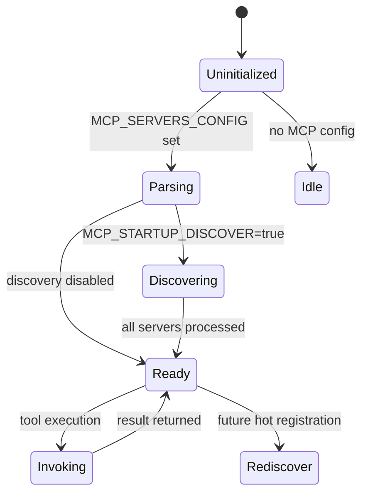
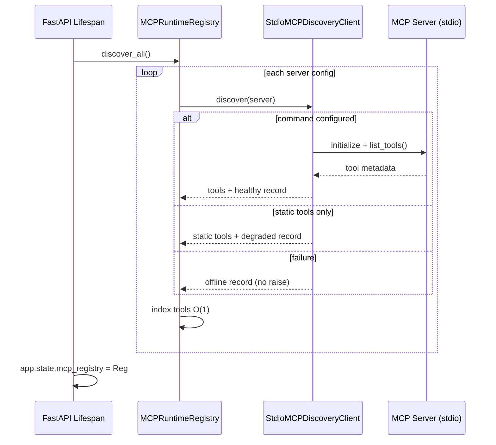

# MCP Runtime Discovery

Phase 3 architecture for dynamic MCP tool registration.

## Registry Lifecycle



1. **App startup** (`main.py` lifespan) creates `MCPRuntimeRegistry` when tools are enabled.
2. **`discover_all()`** runs per-server discovery when `MCP_SERVERS_CONFIG` is set.
3. **Support tools** register as internal server `voxforge-support` via `register_support_tool_discovery()`.
4. Registry is stored on `app.state.mcp_registry` for request-scoped DI.
5. `ToolRegistry` merges builtin tools + support tools + discovered MCP tools for `ToolRouter`.

## Discovery Sequence



## Components

| Component | Layer | Responsibility |
|-----------|-------|----------------|
| `MCPDiscoveryClient` | `core/interfaces/mcp.py` | Port for discovery |
| `MCPInvocationClient` | `core/interfaces/mcp.py` | Port for execution |
| `MCPRuntimeRegistry` | `infrastructure/tools/` | Registry, indexing, health |
| `StdioMCPDiscoveryClient` | `infrastructure/tools/` | stdio `list_tools()` adapter |
| `StdioMCPInvocationClient` | `infrastructure/tools/` | stdio `call_tool()` adapter |
| `ToolRegistry` | `modules/mcp_tool_router/` | Builtin + MCP merge |

## API (additive)

| Method | Path | Description |
|--------|------|-------------|
| GET | `/api/v1/tools` | Unchanged; now includes discovered MCP tools |
| GET | `/api/v1/tools/mcp/health` | Registry health summary |
| GET | `/api/v1/tools/mcp/servers` | Server capability metadata |

`GET /api/v1/tools` response adds optional fields: `server_id`, `version`, `required_scopes`.

## Failure Modes

| Failure | Behavior |
|---------|----------|
| Invalid JSON config | Log warning; registry idle |
| Server timeout | Server marked `offline`; app starts |
| `list_tools()` error | Fall back to static `tools` if present (`degraded`) |
| No static fallback | Server `offline`; tool unavailable |
| Invoke on offline server | `ToolResult` error; no crash |
| MCP package missing | Static fallback or offline |

## Recovery Strategy

- **Restart** — re-runs `discover_all()` on startup
- **Degraded** — static metadata allows routing; invoke may still work if server reachable
- **Future** — hot `register_server()` after operator fixes config without full restart

## Configuration

```env
TOOLS_ENABLED=true
MCP_SERVERS_CONFIG=[{"id":"fs","transport":"stdio","command":"npx","args":[...]}]
MCP_DISCOVERY_ENABLED=true
MCP_DISCOVERY_TIMEOUT_MS=5000
MCP_STARTUP_DISCOVER=true
```

Static `tools` key remains supported for backward compatibility.

## Observability

| Signal | Name |
|--------|------|
| Span | `mcp.registry.discover_all`, `mcp.registry.invoke` |
| Histogram | `voxforge_mcp_discovery_duration_seconds` |
| Counter | `voxforge_mcp_servers_total{status}` |
| Logs | `mcp_discovery_complete`, `mcp_discovery_failed`, `mcp_discovery_timeout` |

## Performance Targets

| Target | Implementation |
|--------|----------------|
| Discovery <100 ms (no servers) | No-op when config empty |
| O(1) tool lookup | `dict` index post-discovery |
| No execution-path overhead | Invoke unchanged; no per-call discovery |
| Failed providers don't block startup | Per-server `try/except` + timeout |

## Future Plugin Architecture

- HTTP/SSE MCP transports via additional `MCPDiscoveryClient` implementations
- Hot registration API guarded by RBAC scopes
- Periodic background re-discovery job
- Org-scoped server allowlists
- Tool policy engine enforcing `required_scopes` against `Principal`

## Trade-offs

- **Last-write-wins** on duplicate tool names keeps implementation simple; operators should
  namespace tools per server or use unique names.
- **Startup discovery only** avoids latency spikes but requires restart for new tools unless
  hot registration is enabled later.
- **Stdio-first** matches current MCP client support; other transports are adapter additions.
