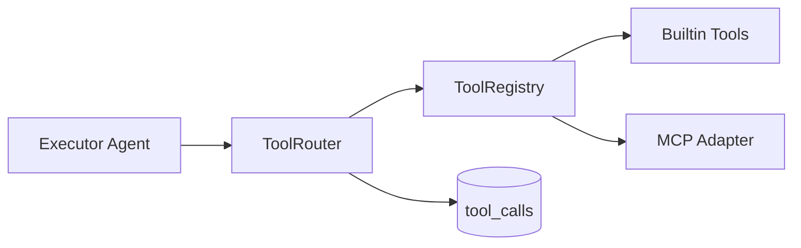

# MCP Tool Router Architecture

## Overview

The MCP Tool Router provides a **provider-agnostic tool execution layer** for the agent orchestrator, with builtin tools and optional MCP server integration.



## Builtin Tools

| Tool | Description |
|------|-------------|
| `get_current_time` | Current UTC timestamp |
| `calculate` | Safe math expression evaluator |
| `echo` | Echo message (testing) |

## MCP Integration

Configure external MCP servers via JSON in `MCP_SERVERS_CONFIG`:

```json
[
  {
    "transport": "stdio",
    "command": "npx",
    "args": ["-y", "@modelcontextprotocol/server-filesystem", "/tmp"],
    "tools": [
      {
        "name": "read_file",
        "description": "Read a file",
        "parameters": {"type": "object", "properties": {"path": {"type": "string"}}}
      }
    ]
  }
]
```

Requires `pip install mcp` for stdio MCP client support.

## Agent Integration

When `ORCHESTRATOR_MODE=multi_agent` and `TOOLS_ENABLED=true`, the **executor** agent:

1. Binds LangChain tools to the LLM
2. Executes tool calls via `ToolRouter`
3. Emits `agent_step` events with `agent: "tool"`
4. Persists calls to `tool_calls` table

## API

| Method | Path | Description |
|--------|------|-------------|
| GET | `/api/v1/tools` | List available tools |
| GET | `/api/v1/sessions/{id}/tool-calls` | Tool call history for session |

## Configuration

```env
TOOLS_ENABLED=true
TOOL_TIMEOUT_SECONDS=30
MAX_TOOL_ITERATIONS=5
MCP_SERVERS_CONFIG=
```

## Metrics

- `voxforge_tool_calls_total{tool_name, status}`
- `voxforge_tool_latency_seconds{tool_name}`
