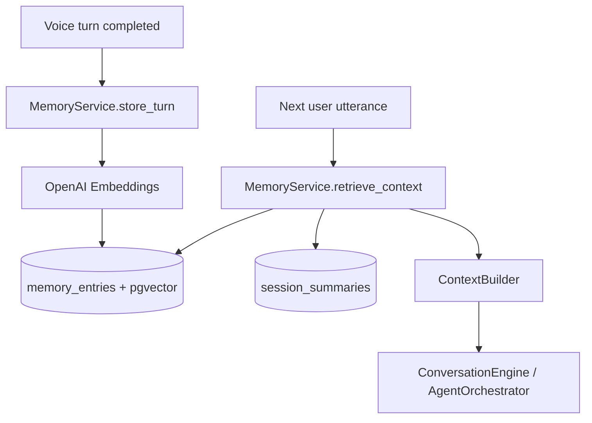

# Memory Architecture

## Overview

The Memory module provides **conversation memory**, **semantic retrieval**, **summarization**, and **context compression** for voice sessions.



## Components

| Component | Role |
|-----------|------|
| `MemoryService` | Orchestrates store, retrieve, summarize |
| `ContextBuilder` | Assembles system + summary + retrieval + recent messages |
| `Summarizer` | Compresses long histories via LLM |
| `MemoryRepository` | Postgres + pgvector persistence (JSON fallback for SQLite tests) |
| `OpenAIEmbeddingProvider` | `text-embedding-3-small` vectors |

## Database

Migration `003_memory` adds:

- `memory_entries` — turn/summary/fact rows with embeddings
- `session_summaries` — rolling compressed context per session
- `embedding_vec vector(1536)` on Postgres for cosine similarity search

## API

| Method | Path | Description |
|--------|------|-------------|
| GET | `/api/v1/sessions/{id}/memory` | List stored memory entries |
| POST | `/api/v1/sessions/{id}/memory/search` | Semantic search within session |

## Configuration

```env
MEMORY_ENABLED=true
MEMORY_EMBEDDING_MODEL=text-embedding-3-small
MEMORY_MAX_RECENT_MESSAGES=10
MEMORY_SUMMARIZE_AFTER_MESSAGES=20
MEMORY_RETRIEVAL_TOP_K=5
MEMORY_SIMILARITY_THRESHOLD=0.65
MEMORY_SUMMARY_MODEL=gpt-4.1-mini
```

## Integration

- **Voice pipeline** stores user/assistant turns after each completed turn
- **ConversationEngine** and **AgentOrchestrator** inject memory context before LLM calls
- **Prometheus**: `voxforge_memory_stores_total`, `voxforge_memory_retrieval_latency_seconds`

## Future improvements

- Cross-session org-level memory
- HNSW index tuning for large corpora
- Memory decay and importance scoring
- User profile facts extraction
