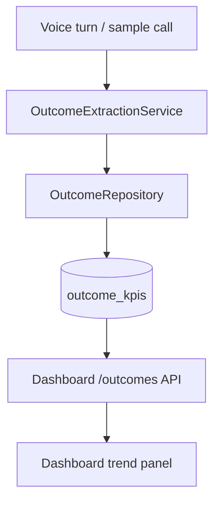

# Outcome KPIs Architecture

## Overview

Outcome KPIs turn session activity into business-facing success signals for support deflection:

- `intent`
- `task_success`
- `escalation`
- `resolution_time_seconds`

## Write path

1. Voice pipeline completes a turn (or onboarding runs a sample call).
2. `OutcomeExtractionService` derives intent/success/escalation.
3. `OutcomeRepository` upserts one row per `session_id`.
4. Prometheus counters/histograms record the write.

Rules are deterministic and metadata-aware:
- metadata flags override heuristics when present
- interrupted turns count as escalated and unsuccessful
- intent falls back to support taxonomy keywords

## Read path

| Method | Path | Description |
|--------|------|-------------|
| GET | `/api/v1/dashboard/outcomes` | Aggregate outcome KPIs |
| GET | `/api/v1/dashboard/outcomes?days=7\|30` | Include daily trend series |

Response includes:
- rates (`task_success_rate`, `escalation_rate`)
- average resolution time
- top intents
- trend points for success vs escalation

## Metrics

- `voxforge_outcome_records_total{intent,task_success,escalation}`
- `voxforge_outcome_resolution_seconds`
- `voxforge_onboarding_steps_total{step,status}`

## Quality gate

Golden scenario pack: `tests/unit/test_outcome_golden_scenarios.py`

Target: >= 90% extraction accuracy across the fixed support conversation suite.
