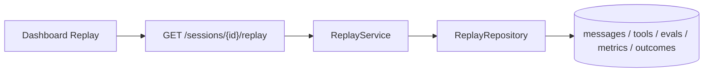

# Session Replay Architecture

## Overview

Session Replay builds a trust/debug timeline for one voice conversation by merging:

- messages
- tool calls
- evaluations
- turn metrics
- outcome KPIs

## API

| Method | Path | Description |
|--------|------|-------------|
| GET | `/api/v1/sessions/{session_id}/replay` | Unified chronological event timeline |

Requires `sessions:read`. Responses are org-scoped.

## Event types

| `event_type` | Source |
|--------------|--------|
| `message` | `messages` |
| `tool_call` | `tool_calls` |
| `evaluation` | `evaluation_runs` (+ metrics) |
| `metric` | `session_metrics` |
| `outcome` | `outcome_kpis` |

Events are sorted ascending by timestamp.

## Dashboard usage

1. Open **Sessions** and click **Replay**, or
2. Open **Replay**, paste a session UUID, and click **Load Replay**

Outcome summary renders above the timeline when available.
