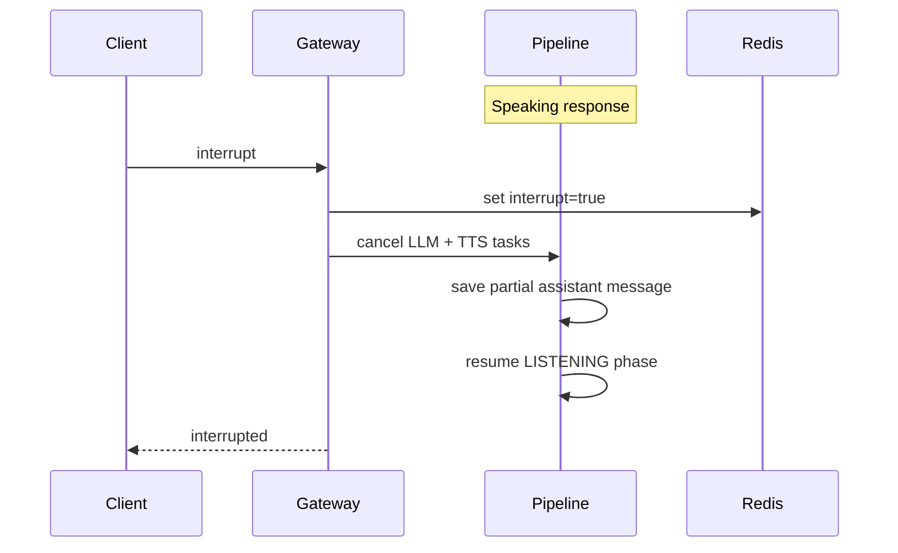

# Voice Pipeline Architecture

## Overview

VoxForge's voice pipeline implements a real-time streaming loop:

**Audio In → STT → LLM → TTS → Audio Out**

All stages stream concurrently with support for barge-in (interrupt) handling.

## Components

### Voice Gateway (`api/ws/voice.py`)

WebSocket endpoint at `/api/v1/ws/voice`. Handles:
- Connection lifecycle
- JSON control messages (start, interrupt, end, ping)
- Binary PCM audio frames (16kHz, 16-bit, mono)
- Streaming responses back to client

### Session Manager (`modules/session_manager/`)

Manages voice session lifecycle:
- **PostgreSQL**: Persistent session records, messages, metrics
- **Redis**: Ephemeral streaming state (phase, sequence, interrupt flag)
- Heartbeat every 15s, stale detection after 45s
- Reconnect via `resume` with `session_id` + `last_sequence`

### STT Module — Deepgram (`infrastructure/providers/stt/deepgram.py`)

- Streaming WebSocket to Deepgram API
- Emits partial and final `TranscriptEvent`s
- Language detection when not specified

### Conversation Engine (`modules/conversation/application/engine.py`)

- Maintains per-session message history
- Streams tokens from OpenAI Chat Completions API
- System prompt injected at session start

### TTS Module — Cartesia (`infrastructure/providers/tts/cartesia.py`)

- Sentence-boundary buffering before synthesis
- Streams PCM audio chunks (24kHz, s16le)
- HTTP streaming to Cartesia TTS API

### Voice Pipeline Orchestrator (`modules/voice_gateway/application/pipeline.py`)

Coordinates the full turn:
1. Stream audio to STT, forward partial transcripts
2. On final transcript, save user message
3. Stream LLM tokens to client and TTS concurrently
4. Save assistant message and turn metrics
5. Handle interrupt at any stage

## Wire Protocol

### Client → Server

| Message | Format |
|---------|--------|
| Start | `{"type": "start", "config": {"language": "en", "voice_id": "..."}}` |
| Resume | `{"type": "start", "session_id": "uuid", "last_sequence": 0}` |
| Audio | Binary PCM 16kHz mono frames |
| Interrupt | `{"type": "interrupt"}` |
| End | `{"type": "end"}` |
| Ping | `{"type": "ping"}` |

### Server → Client

| Message | Format |
|---------|--------|
| Started | `{"type": "started", "session_id": "uuid"}` |
| Transcript | `{"type": "transcript", "partial": true, "text": "...", "confidence": 0.95}` |
| Response | `{"type": "response", "token": "..."}` |
| Audio | Binary PCM audio chunks |
| Metric | `{"type": "metric", "stt_ms": 120, "llm_first_token_ms": 340, ...}` |
| Error | `{"type": "error", "code": "...", "message": "..."}` |
| Pong | `{"type": "pong"}` |

## Interrupt Flow (Barge-in)

## Database Schema

- `voice_sessions` — session metadata and status
- `messages` — conversation history (user, assistant, system)
- `session_metrics` — per-turn latency breakdown

## Observability

- **Logs**: Structured JSON with `session_id`, `provider`, `latency_ms`
- **Traces**: OpenTelemetry spans for `voice.session`, `stt.transcribe`, `llm.generate`, `tts.synthesize`
- **Metrics**: Prometheus histograms for STT/LLM/TTS/e2e latency, gauges for active sessions and WS connections

## Performance Targets

| Metric | Target |
|--------|--------|
| STT first partial | < 300ms |
| LLM first token | < 500ms |
| TTS first audio byte | < 200ms after first sentence |
| End-to-end | < 1.5s |

## LiveKit/WebRTC

LiveKit is implemented as a transport adapter into the same `VoicePipelineService`.
See [livekit-integration.md](./livekit-integration.md) for lifecycle and worker operations. See [failure-recovery.md](./failure-recovery.md) for cross-cutting failure modes and recovery behavior.
