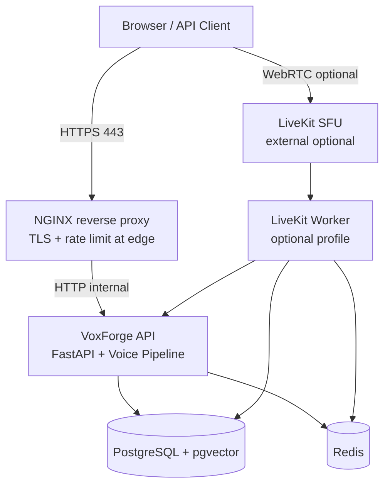

# Deployment Architecture Overview

## Production topology

## Request paths

| Path | Handler |
|------|---------|
| `/` | Static landing page |
| `/demo` | Interactive demo UI |
| `/dashboard` | Operator dashboard |
| `/api/v1/*` | REST API |
| `/api/v1/ws/voice` | WebSocket voice transport |
| `/api/v1/metrics` | Blocked at NGINX (internal only) |

## Process model

- **Single uvicorn worker** in production compose (predictable memory; scale horizontally with multiple VPS instances later).
- **LiveKit worker** is a separate container per deployment when WebRTC is enabled.
- **Migrations** run automatically via `scripts/docker-entrypoint.sh` before API start.

## Data stores

| Store | Purpose | Backup |
|-------|---------|--------|
| PostgreSQL | Sessions, auth, memory vectors, evaluations | `scripts/backup_postgres.sh` |
| Redis | Session state, rate limit counters | Ephemeral — rebuild on restart |

## Observability

- App exposes `/api/v1/health` (liveness) and `/api/v1/ready` (DB + Redis).
- Prometheus metrics at `/api/v1/metrics` — not exposed publicly in production NGINX config.
- Container logs rotated via Docker `json-file` driver (`max-size` / `max-file`).

## Resource targets (4 GB VPS)

| Service | CPU limit | Memory limit |
|---------|-----------|--------------|
| postgres | 1.0 | 1 GB |
| redis | 0.5 | 256 MB |
| app | 2.0 | 2 GB |
| nginx | 0.5 | 128 MB |
| livekit-worker | 1.0 | 1 GB |

## Environments

| Profile | Compose file | Image |
|---------|--------------|-------|
| Development | `docker-compose.yml` | `Dockerfile` (reload, dev deps) |
| Production | `docker-compose.prod.yml` | `Dockerfile.prod` |
