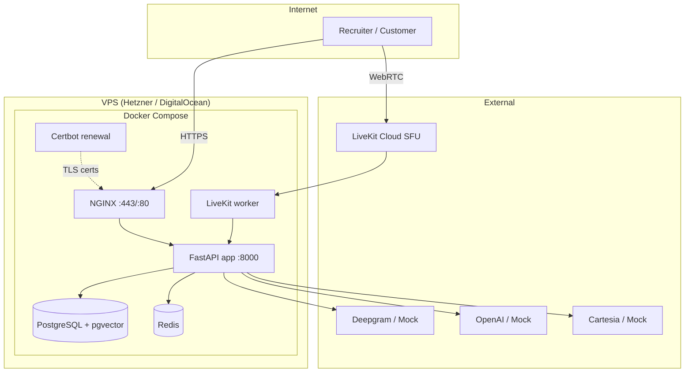

# VoxForge Deployment Architecture

Production deployment architecture for the public hosted platform.

## System diagram



## Request paths

### Public demo (under 1 minute)

```
GET  /              → landing page (static)
GET  /demo          → demo UI (static)
POST /api/v1/demo/quickstart → VoicePipelineService (mock providers)
GET  /api/v1/demo/info       → demo account metadata
```

### Authenticated operator flow

```
POST /api/v1/auth/login → JWT
GET  /dashboard         → analytics UI
GET  /api/v1/dashboard/* → session metrics, evaluations
```

### Voice transport

| Transport | Entry | Pipeline |
|-----------|-------|----------|
| WebSocket | `/api/v1/ws/voice` | `VoicePipelineService` |
| LiveKit WebRTC | `/api/v1/livekit/sessions/{id}/token` | Same pipeline via worker |
| Programmatic | `/api/v1/onboarding/run-sample-call` | Same pipeline |

LiveKit is a **transport adapter** — it does not duplicate business logic (ADR-004).

## Layer separation

```
┌─────────────────────────────────────────────┐
│  Presentation: landing, demo, dashboard, API │
├─────────────────────────────────────────────┤
│  Transport: WebSocket, LiveKit adapter     │
├─────────────────────────────────────────────┤
│  Orchestration: agent orchestrator, session  │
├─────────────────────────────────────────────┤
│  Business: onboarding, memory, tools, eval  │
├─────────────────────────────────────────────┤
│  Infrastructure: Postgres, Redis, providers  │
├─────────────────────────────────────────────┤
│  Observability: structlog, OTEL, Prometheus  │
└─────────────────────────────────────────────┘
```

## Network boundaries

| Surface | Exposure | Protection |
|---------|----------|------------|
| NGINX :443 | Public | TLS, HSTS, security headers |
| app :8000 | Internal only | Docker network |
| postgres | Internal only | No host port |
| redis | Internal only | No host port |
| `/api/v1/metrics` | Blocked at NGINX | 403 in production |
| `/api/v1/demo` | Public | Rate limited |

## Data stores

| Store | Purpose | Persistence |
|-------|---------|-------------|
| PostgreSQL | Users, sessions, messages, memory vectors, evaluations | Volume `postgres_data` |
| Redis | Session state, rate limit counters | Volume `redis_data` |
| `deploy/backups/` | SQL dumps | Host filesystem |

## Startup sequence

1. Postgres + Redis healthchecks pass
2. `app` entrypoint validates production env
3. Alembic migrations (`alembic upgrade head`)
4. Demo account password sync (if `DEMO_ENABLED`)
5. Uvicorn starts, healthcheck passes
6. NGINX proxies traffic

Typical cold start: **40–90 seconds** (includes migration check and health start-period).

## Related ADRs

- [ADR-001](../adr/ADR-001-programmatic-voice-pipeline-runner.md) — Programmatic pipeline
- [ADR-004](../adr/ADR-004-livekit-transport-adapter.md) — LiveKit transport adapter

See also [voice-pipeline.md](../architecture/voice-pipeline.md) and [livekit-integration.md](../architecture/livekit-integration.md).
