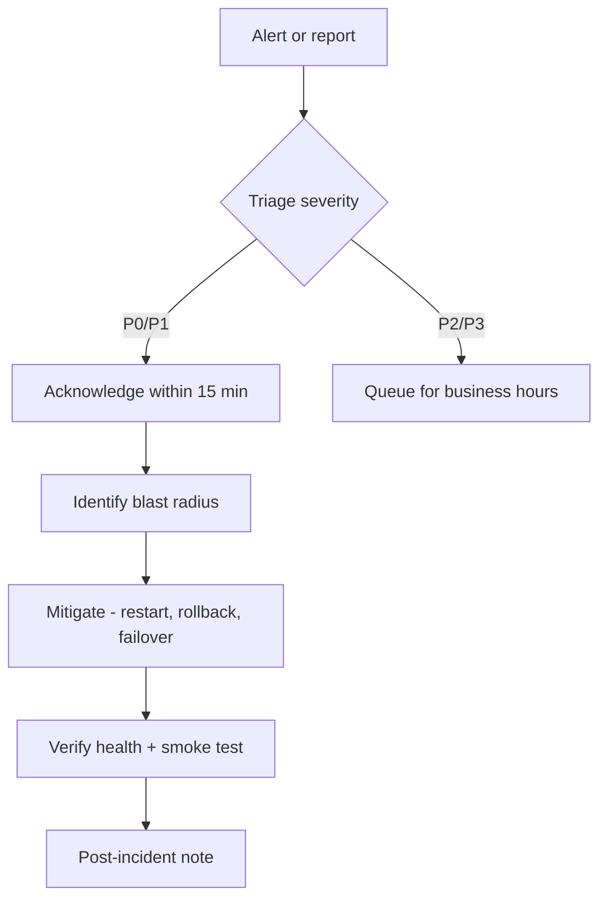

# Incident Response

## Severity definitions

| Level | Definition | Example |
|-------|------------|---------|
| **P0** | Complete outage or data loss risk | Site unreachable, DB corruption |
| **P1** | Major feature broken for all users | Auth down, voice pipeline 100% fail |
| **P2** | Partial degradation | Slow responses, single provider fail |
| **P3** | Cosmetic / low impact | UI glitch, non-critical log noise |

## Response workflow



## P0 playbook — site down

1. **Verify externally:** `curl -fsS https://voxforge.brohammad.tech/api/v1/health`
2. **SSH to VPS:** `ssh root@<DROPLET_IP>`
3. **Check compose:** `cd /opt/VoxForge && ./deploy.sh status`
4. **Restart:** `docker compose -f docker-compose.prod.yml restart nginx app`
5. **If persistent:** `./deploy.sh down && ./deploy.sh up`
6. **DNS/TLS:** Verify A record, `certbot certificates`
7. **Communicate:** Update GitHub issue / status note

## P1 playbook — voice pipeline failure

1. Check provider status pages (OpenAI, Deepgram, ElevenLabs)
2. Switch to mock providers temporarily: set `STT_PROVIDER=mock` etc. in `.env.production`, `./deploy.sh up`
3. Review app logs for `ProviderError`
4. Check Redis + Postgres readiness

## Communication template

```
Incident: [title]
Severity: P0/P1/P2
Started: [UTC time]
Impact: [who/what affected]
Status: Investigating | Mitigating | Resolved
Next update: [time]
```

## Post-incident

Within 48 hours document:

- Timeline
- Root cause
- Mitigation taken
- Preventive action item

Store in `docs/operations/incidents/` (create per incident).
