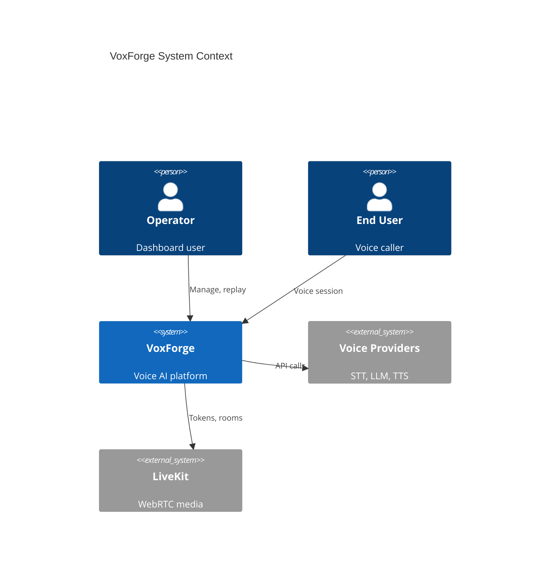
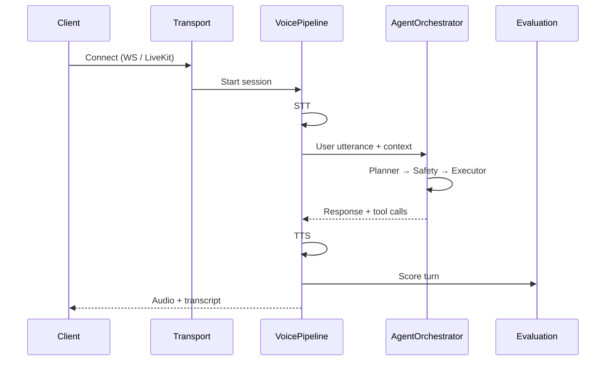
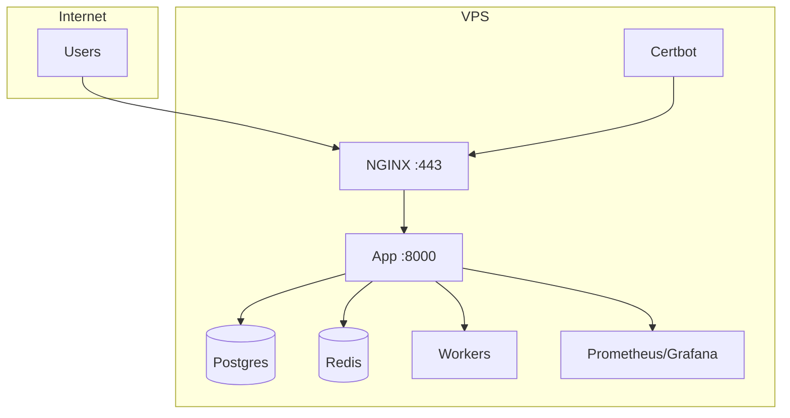
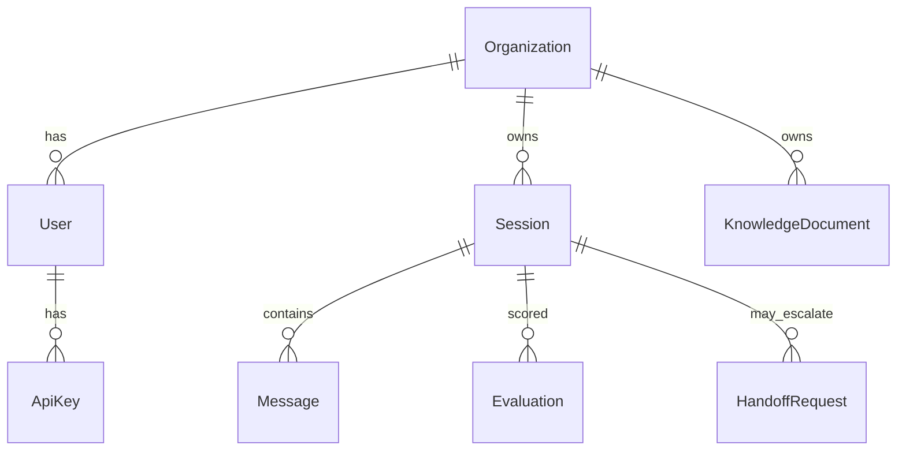
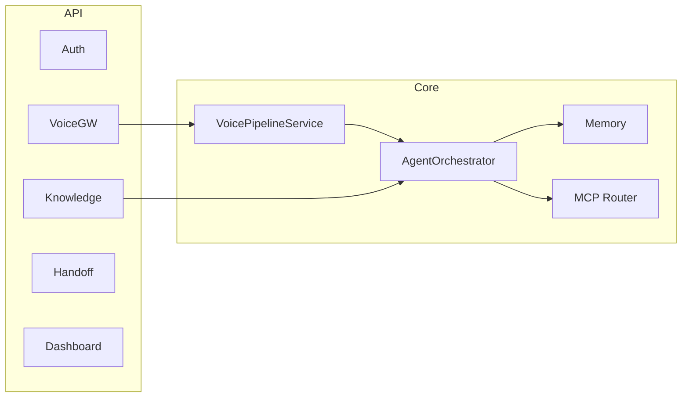

# Architecture Diagrams

## System context

## Voice session sequence

## Deployment topology

## Database ERD (core entities)

## Component diagram

Export PNGs for README: use [Mermaid Live Editor](https://mermaid.live) or `mmdc -i diagram.mmd -o diagram.png`.
