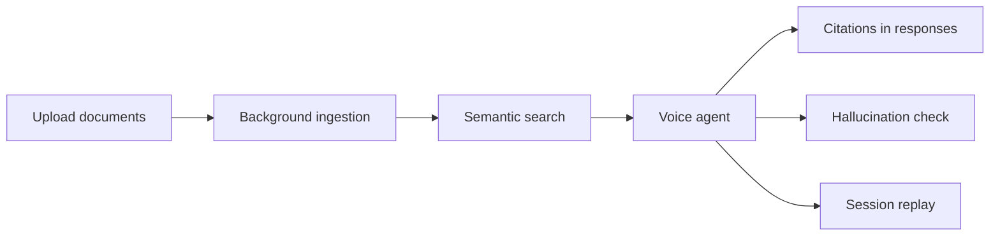

# Enterprise Knowledge Base

VoxForge Enterprise Knowledge Base turns your document corpus into **searchable,
citable context** for voice agents — with full multi-tenant isolation and
platform-native evaluation, replay, and observability.

## What it does

Upload PDF, Markdown, HTML, TXT, or CSV files. VoxForge ingests them in the
background, chunks and embeds the content, stores vectors in PostgreSQL
(pgvector), and makes the corpus available to agents via semantic search with
structured citations.



## Supported formats

| Format | Parsing | Chunking |
|--------|---------|----------|
| PDF | Text extraction per page | Page-aware or recursive |
| Markdown | Heading structure preserved | Section-aware recursive |
| HTML | Script/style stripped | Recursive |
| TXT | UTF-8 decode | Recursive |
| CSV | Header + row metadata | Row-based chunks |

## Key capabilities

- **Multi-tenant** — Each organization's documents are fully isolated
- **Background ingestion** — Upload returns immediately; poll job progress
- **Versioning** — Every re-upload creates a new version; rollback supported
- **Incremental updates** — Only changed chunks are re-embedded
- **Re-indexing** — Re-embed all chunks when switching embedding models
- **Citations** — Every search result includes document title, page, and excerpt
- **No vendor lock-in** — Swappable embedding providers and blob storage

## Agent integration

The existing `knowledge_base_lookup` tool automatically uses your uploaded
corpus when `KNOWLEDGE_BASE_PROVIDER=internal`. No agent config changes required.

Retrieved citations flow into:

- Agent system context before LLM calls
- Hallucination evaluation (grounding check)
- Session replay timeline
- Dashboard tool call inspection

## API quick start (proposed)

```bash
# Create a collection
curl -X POST /api/v1/knowledge/collections \
  -H "Authorization: Bearer $TOKEN" \
  -d '{"name": "support-docs"}'

# Upload a document
curl -X POST /api/v1/knowledge/collections/{id}/documents \
  -H "Authorization: Bearer $TOKEN" \
  -F "file=@handbook.pdf" \
  -F "title=Employee Handbook"

# Poll ingestion progress
curl /api/v1/knowledge/documents/{id}/jobs/{job_id} \
  -H "Authorization: Bearer $TOKEN"

# Semantic search
curl -X POST /api/v1/knowledge/search \
  -H "Authorization: Bearer $TOKEN" \
  -d '{"query": "refund policy", "limit": 5}'
```

## Configuration

```env
KNOWLEDGE_ENABLED=true
KNOWLEDGE_BASE_PROVIDER=internal
EMBEDDING_PROVIDER=openai
KNOWLEDGE_WORKER_ENABLED=true
```

See [Knowledge Base Architecture](../architecture/knowledge-base.md) for full
configuration reference.

## Roles and permissions

| Action | Owner | Admin | Member |
|--------|-------|-------|--------|
| Search | Yes | Yes | Yes |
| Upload documents | Yes | Yes | No |
| Delete documents | Yes | Yes | No |
| Re-index | Yes | Yes | No |

## Implementation status

| Phase | Status | Deliverable |
|-------|--------|-------------|
| Design | **Review** | Architecture, ADR, tests, benchmarks |
| Phase 1 | Planned | Schema, parsers, chunking |
| Phase 2 | Planned | Ingestion worker, job API |
| Phase 3 | Planned | Search, citations, tool adapter |
| Phase 4 | Planned | Agent context, evaluation hooks |
| Phase 5 | Planned | Dashboard UI |

## Related documentation

- [Knowledge Base Architecture](../architecture/knowledge-base.md)
- [ADR-005: Enterprise Knowledge Base](../adr/ADR-005-enterprise-knowledge-base.md)
- [Knowledge Base Benchmarks](../benchmarks/knowledge-base.md)
- [Customer Support Tools](../architecture/customer-support-tools.md)
